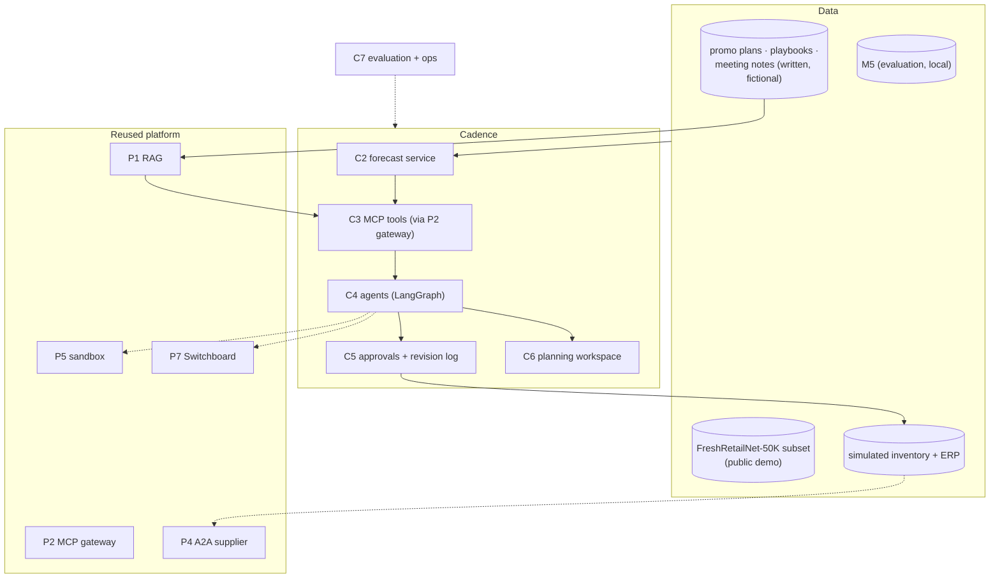

# 1. Requirements

## 1.1 Problem statement

A demand planner's week is a loop: review last week's errors, adjust the statistical forecast for things
the history can't know, agree the numbers, and turn them into orders. In 2026 every planning vendor sells
"agentic planning", and the pitch is always the same: agents monitor signals, recommend adjustments with a
rationale, and planners manage exceptions.

Three things usually go unmeasured in those pitches:
- **Do the adjustments help?** Research on judgmental forecast adjustments has long found that many
  overrides add little or negative value. Planning teams track this with **Forecast Value Added (FVA)**.
  An AI that adjusts forecasts needs the same scrutiny.
- **Where do the numbers come from?** An LLM that writes forecast numbers is unauditable. The 2026
  research framing of **"last-mile forecasting"** puts LLM agents *on top of* a forecasting backbone,
  restricted to explicit, safe revision actions with a trace of evidence.
- **Does it improve decisions?** Accuracy matters because of stock: fill rate, lost sales and inventory
  cost.

**Goal:** Build **Cadence**, a demand-planning copilot on public retail data, where:
1. A **forecast service** produces probabilistic, hierarchically consistent forecasts (statistical
   baselines, a LightGBM global model, the Chronos-2 foundation model, an ensemble), backtested.
2. **LLM agents** do the last mile: find context (promo plans, playbooks, meeting notes), propose **typed,
   bounded revision actions** with citations, explain drivers, and propose orders.
3. **A planner approves** every adjustment above a threshold and every order.
4. Everything is **measured**: accuracy, FVA per adjustment, a replenishment simulation, agent
   reliability, RAG quality, security and cost per session.

It reuses Projects 1–7 as its platform.

## 1.2 What gets built

| # | Component | What it is |
|---|---|---|
| C1 | **Data platform** | A canonical schema (series, calendar, prices, events, sales, stock status) in Postgres + Parquet/DuckDB; loaders for M5 and FreshRetailNet-50K; a written document set (promo plans, category playbooks, meeting notes) that describes real events in the data; a simulated inventory and ERP |
| C2 | **Forecast service** | Trusted Python service: baselines (seasonal naive, ETS, Croston-family for intermittent series), a LightGBM global model, Chronos-2 with covariates, an ensemble; quantiles; hierarchical reconciliation; rolling-origin backtests; versioned forecast runs |
| C3 | **MCP tools** | `sales`, `forecast`, `inventory`, `knowledge` (P1 RAG), `memory` (P3's design) and the P5 `sandbox` broker, all behind the P2 gateway with OAuth and Cedar policies by role |
| C4 | **Agents** | A LangGraph supervisor with specialists: **Forecast Reviewer** (context → revision actions), **Analyst** (drivers, error analysis, sandbox code), **Planner** (order proposals); a single-agent baseline for comparison |
| C5 | **Approvals & actions** | Revision actions applied by code within bounds; signed approval tokens (P3) for large adjustments and all orders; idempotent order submission; a revision trace per session |
| C6 | **Planning workspace** | P6's Next.js shell: exception list, forecast charts with bands and before/after, adjustment diffs with evidence, scenario sliders, approval inbox, tool timeline, cost per session |
| C7 | **Evaluation & ops** | Backtests, PlanBench-60 (FVA), replenishment simulation, trajectory and pass^k evals (P3 harness), RAG evals (P1), red-team suite, cost/latency via P7, CI gate |

## 1.3 Users & use cases

| Actor | Use case |
|---|---|
| **Demand planner** | Reviews exceptions, asks why a forecast moved, accepts or edits adjustments, approves orders |
| **Category manager** | Enters or uploads a promo plan; sees its expected effect on the forecast |
| **Supply planner** | Reviews order proposals against lead times and supplier confirmations |
| **Planning lead** | Reviews FVA: which adjustments (human and AI) helped; sets approval thresholds |
| **Supplier (agent)** | Receives purchase orders over A2A and confirms, partially fills or delays them |
| **Platform/security reviewer** | Checks roles, tenant isolation, approval enforcement and the audit trail |

## 1.4 Functional requirements

### Data and forecasting

| ID | Requirement | Priority |
|---|---|---|
| FR-1 | Canonical schema and loaders for M5 (local evaluation) and a FreshRetailNet-50K subset (public demo); data provenance recorded; raw M5 files never committed | Must |
| FR-2 | Forecast models: seasonal naive, ETS, Croston/TSB for intermittent series, LightGBM global model with calendar/price/event features, Chronos-2 with covariates, and a weighted ensemble | Must |
| FR-3 | Probabilistic output: quantiles (at least 0.1, 0.5, 0.9, 0.95) for every series and horizon (28 days) | Must |
| FR-4 | Hierarchical reconciliation across item → dept → category → store → state → total, so numbers add up | Must |
| FR-5 | Rolling-origin backtests with versioned runs; metrics stored per series, level and model | Must |
| FR-6 | Scenario re-forecast for a slice (≤ 200 series) with changed covariates, e.g. "price −10% in week 2" | Must |
| FR-7 | TimesFM 2.5 as a second foundation model in the comparison (univariate) | Should (in the chosen full plan) |
| FR-8 | Stockout-aware demand (censored sales) on FreshRetailNet-50K | Could |

### Agents and actions

| ID | Requirement | Priority |
|---|---|---|
| FR-9 | Exception list: largest recent errors, upcoming events, low projected stock, series with big model disagreement | Must |
| FR-10 | Forecast Reviewer proposes **revision actions** only from a typed set (scale, shift, override-with-bounds, cap/floor), each with a scope, a window, a reason and **evidence citations**; the LLM never writes forecast numbers | Must |
| FR-11 | Revision actions are validated and applied by code (bounds, windows, hierarchy re-reconciled) and shown as a before/after diff | Must |
| FR-12 | Adjustments above a threshold (default: > ±25% on any series or > 5% at category level) need planner approval | Must |
| FR-13 | Analyst explains drivers and past errors; any LLM-written code runs only in the P5 sandbox | Must |
| FR-14 | Planner agent proposes orders from forecast quantiles, on-hand, open orders, lead time and a target service level; **every order needs a signed approval** | Must |
| FR-15 | Orders are submitted idempotently to the simulated ERP; the supplier agent confirms over A2A | Must (ERP) / Should (A2A) |
| FR-16 | Memory of planner preferences and past decisions (P3's memory design) with provenance and a write policy | Should |
| FR-17 | A single-agent baseline with the same tools, for the multi-agent comparison | Must |

### Workspace, knowledge and operations

| ID | Requirement | Priority |
|---|---|---|
| FR-18 | Workspace: exceptions, forecast chart with bands and before/after, adjustment diff with citations, scenario sliders, approval inbox, tool-call timeline, session cost | Must |
| FR-19 | Knowledge answers with citations over playbooks, promo plans and notes (P1 pipeline behind an MCP tool) | Must |
| FR-20 | Multi-tenant: two fictional retailer orgs; roles planner, category manager, supply planner, viewer; data isolation by RLS and Cedar | Must |
| FR-21 | FVA dashboard: every adjustment (AI and human) scored once actuals arrive | Must |
| FR-22 | All LLM calls through Switchboard (P7); traces in Langfuse; cost per session | Must |

## 1.5 Non-functional requirements (targets)

| Area | Target |
|---|---|
| Interactive latency | First token ≤ 2 s p95; a full review of one slice (context search + revision proposal) ≤ 45 s p95 |
| Scenario re-forecast | ≤ 5 s p95 for ≤ 200 series |
| Batch | Nightly forecast of the demo scope ≤ 30 min; full M5 backtests run offline |
| Cost | ≤ $0.40 per planning session (median), measured by the P7 ledger |
| Accuracy | The ensemble beats seasonal naive and ETS on WRMSSE, with CIs; a model that doesn't is reported, not hidden |
| FVA | Agent adjustments have **positive mean FVA** on PlanBench-60 with a harmful-adjustment rate reported (target ≤ 15%) |
| Safety | 0 orders placed without a valid approval; 0 cross-tenant reads in the red-team suite |
| Reliability | pass^3 on PlanBench-60 core tasks reported for both agent designs |

## 1.6 Success criteria

1. **Forecast report:** backtests on M5 with WRMSSE, WAPE and scaled quantile loss for every model, with
   reconciliation on and off.
2. **FVA report:** agent adjustments vs the statistical forecast on PlanBench-60: mean FVA with CI,
   harmful-adjustment rate, and the "no-context" control where the right move is to change nothing.
3. **Replenishment report:** fill rate, lost sales and inventory cost in simulation for each forecast
   source, including the agent-adjusted one.
4. **Agent report:** multi-agent vs single-agent on PlanBench-60: success, pass^3, cost and latency.
5. **Security:** red-team suite results (poisoned notes, runaway orders, cross-tenant, memory poisoning,
   approval bypass), with 0 approval bypasses.
6. **Public demo** on FreshRetailNet-50K data, a 3-minute video and a post; the README includes cost per
   session, latency, the threat model, trade-offs and **what failed**.

## 1.7 Scope

**In scope:**
- Daily store-SKU forecasting for 28 days, reconciliation, backtests.
- Agent-proposed revision actions and orders with approvals.
- Simulated inventory, ERP and supplier.
- The workspace, evaluation suites and deployment.

**Out of scope:**
- Connecting to a real ERP or planning system.
- Multi-echelon inventory optimization and price optimization.
- Training or fine-tuning foundation models (fine-tuning Chronos-2 is a Could, not planned).
- New-product forecasting without history (mentioned in the report as a limitation).

**Time box:** 6 weeks in the roadmap (weeks 42–47), the full plan (Option A) of the [build plan](09-build-plan/README.md).
