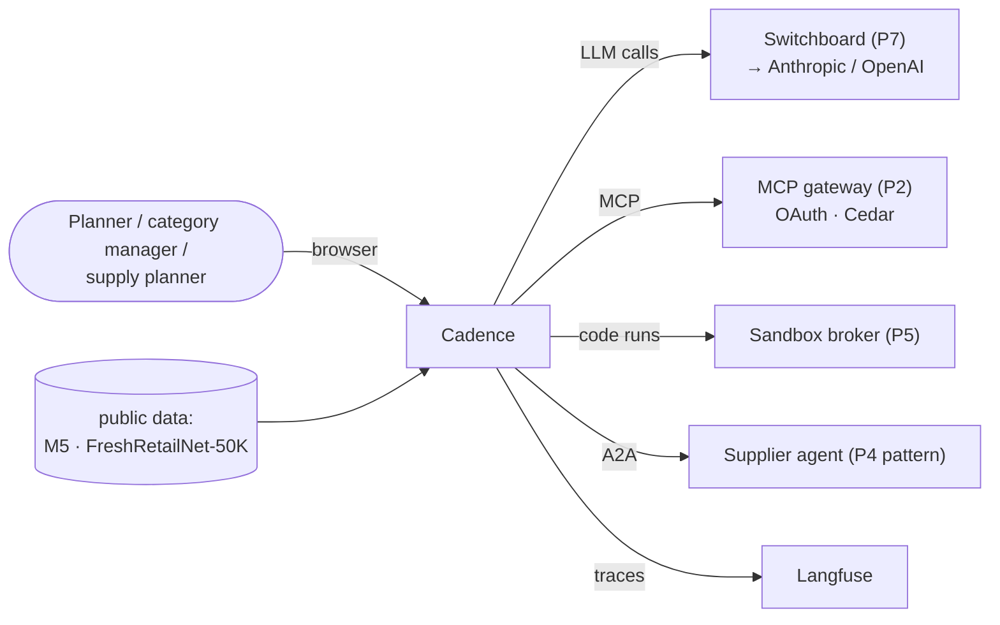
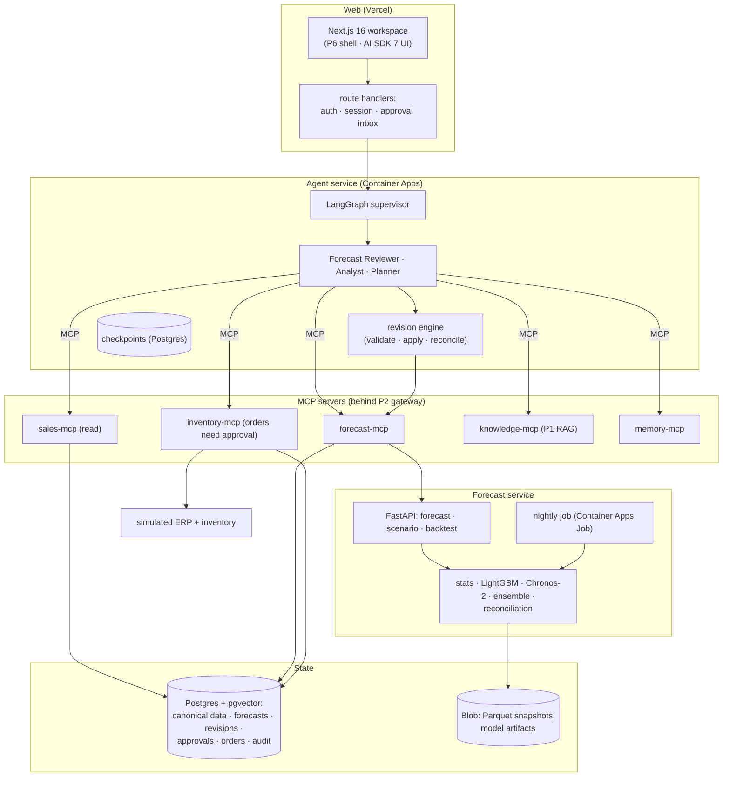
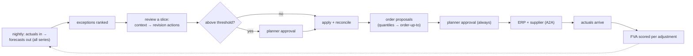
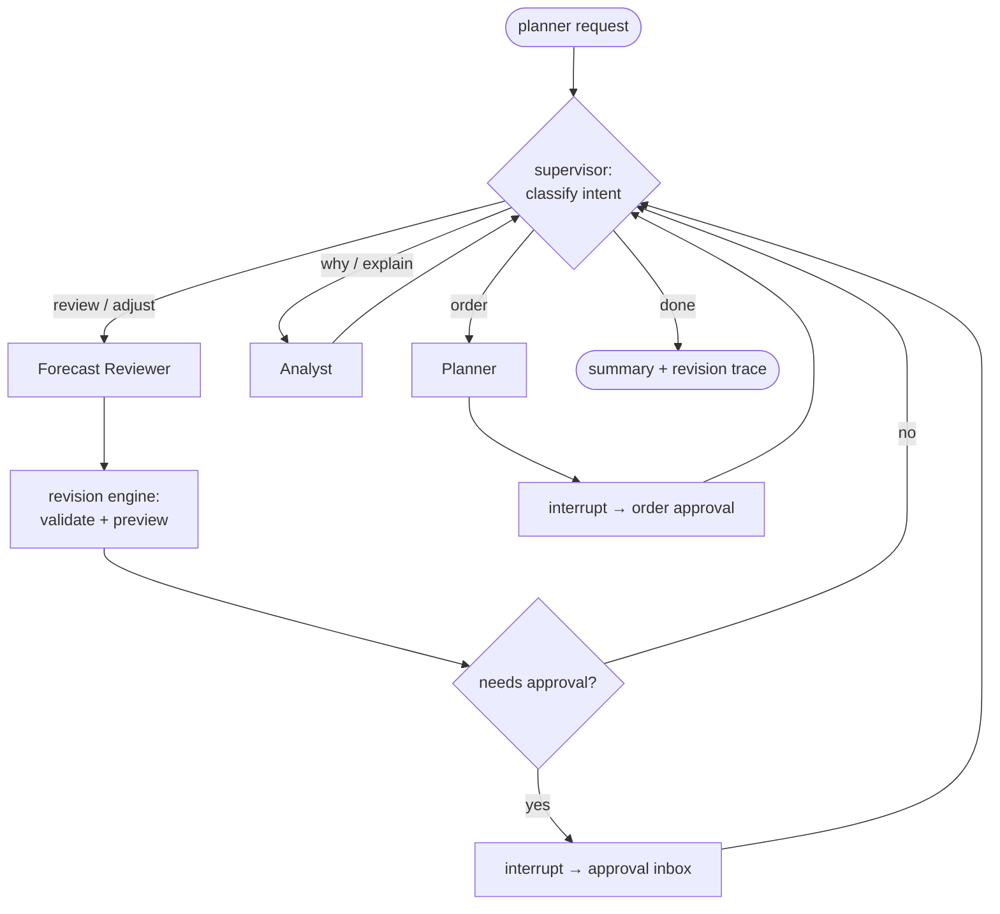
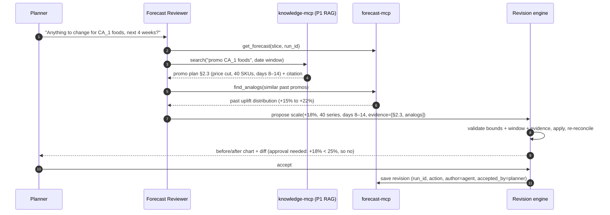
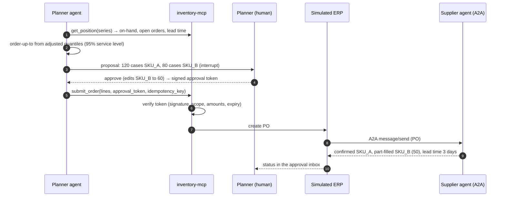
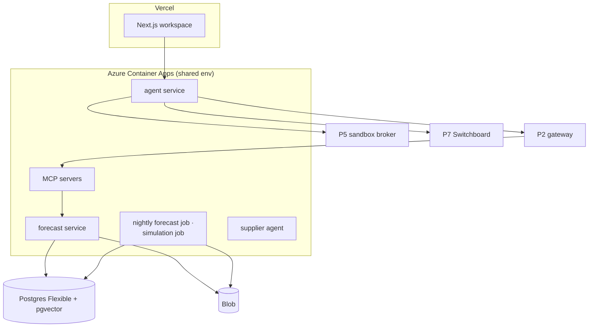

# 2. High-Level Architecture

## 2.1 Design principles

1. **Models make numbers, agents make proposals.** Forecast numbers come only from the forecast service.
   Agents propose typed revision actions and orders; code validates and applies them.
2. **Every change carries its evidence.** A revision action without a citation (a document chunk, a past
   analog, a data query) is rejected.
3. **Money needs a human.** Orders and large adjustments need a signed approval. The approval is checked
   by the tool, not by the prompt.
4. **Trusted code runs as services; LLM-written code runs in the sandbox.** The forecast service is our
   own, tested code. Anything an agent writes on the fly goes to the P5 sandbox.
5. **Measure like a planning team.** Accuracy, FVA and simulated service levels, not just "the answer
   looked right".
6. **Reuse the platform.** MCP through P2's gateway, RAG from P1, agent reliability patterns from P3, A2A
   from P4, the sandbox from P5, the web shell from P6, and all model calls through P7.

## 2.2 System context (C4 level 1)



## 2.3 Containers (C4 level 2)



| Container | Responsibility |
|---|---|
| **Workspace** | Exceptions, charts, diffs, scenario sliders, approval inbox, timeline; streams agent output as typed UI parts |
| **Agent service** | LangGraph graph with checkpoints; the revision engine that validates and applies actions; approval token checks happen in tools |
| **MCP servers** | The only way agents touch data or act; each has a narrow tool set and Cedar policies per role |
| **Forecast service** | Model fitting, prediction, scenarios, reconciliation, backtests; no LLM inside |
| **Simulated ERP** | Inventory positions, open orders, receipts; runs the replenishment simulation day by day |
| **Supplier agent** | An A2A agent in a separate "supplier" org that confirms, part-fills or delays orders |

## 2.4 The weekly planning loop



## 2.5 The agent graph



The supervisor routes, the specialists each have a small tool set, and every action that changes a plan
or spends money goes through an interrupt. The same tools are given to a **single-agent baseline**, so
the evaluation can say whether the multi-agent design earns its extra cost ([ADR-006](07-decisions.md)).

## 2.6 Data flow A: a context-driven adjustment



## 2.7 Data flow B: an order with approval and a supplier



## 2.8 Deployment view



GPU is not assumed. Chronos-2 runs on CPU for the demo scope; full-M5 foundation-model backtests run on a
rented GPU or a stratified sample (decided in the first spike, [06 §6.2](06-non-functional.md#62-batch-sizing)).

## 2.9 Proposed repository layout

```
cadence/
├─ data/               # loaders (M5, FreshRetailNet-50K), canonical schema, provenance records (no raw M5)
├─ docs-corpus/        # fictional promo plans, playbooks, meeting notes (+ ground-truth links to events)
├─ forecast/           # models, ensemble, reconciliation, backtests, scenario API, nightly job
├─ sim/                # inventory + ERP simulator, order policies, supplier agent (A2A)
├─ mcp/                # sales, forecast, inventory, memory servers (knowledge = P1, sandbox = P5)
├─ agents/             # LangGraph supervisor + specialists, single-agent baseline, revision engine
├─ web/                # Next.js workspace (P6 shell packages)
├─ evals/              # backtest reports, PlanBench-60, FVA, replenishment, trajectory, RAG, red team
├─ infra/              # Terraform, compose
└─ docs/
```
