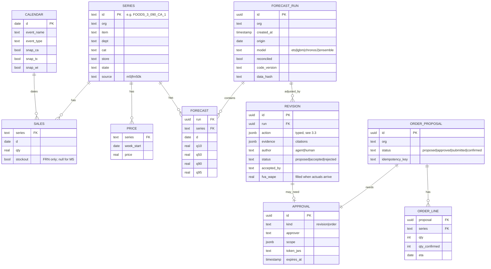
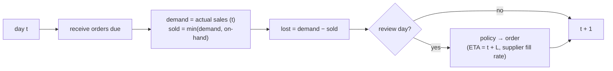

# 3. Low-Level Design

## 3.1 Canonical data model



Every table has `org` and Postgres row-level security (the P6 pattern). Raw M5 files stay outside the
repo; the loader writes a provenance record (source URL, file hashes, download date) instead.

## 3.2 Forecast service

| Model | Role | Notes |
|---|---|---|
| `snaive` | Floor baseline | Same weekday last week |
| `ets` / `theta` | Statistical baselines | Per series, fast (statsforecast) |
| `croston_tsb` | Intermittent series | Many M5 item-store series are mostly zeros |
| `lgbm` | Global ML model | One model across series: lags, rolling stats, calendar, price, events, SNAP; Tweedie loss (as in strong M5 solutions); quantiles via separate quantile models or conformal intervals |
| `chronos2` | Foundation model | Zero-shot with past and known-future covariates (price, events, SNAP) via group attention |
| `timesfm25` | Second foundation model (Should) | For the comparison only |
| `ensemble` | Shipped forecast | Weighted by backtest skill per level (weights fitted on a validation origin, frozen for test) |

**Reconciliation:** MinT (shrinkage) across the M5 hierarchy, applied to the median and propagated to
quantiles with the approach supported by the reconciliation library (verified in the first spike).

**Service API:**

| Endpoint | Purpose |
|---|---|
| `POST /forecast/run` | Batch run for an org and origin (nightly job) |
| `GET /forecast/{run}/slice` | Quantiles for a filter (store, dept, series list, dates) |
| `POST /forecast/scenario` | Re-forecast ≤ 200 series with changed future covariates; returns a scenario run (never overwrites) |
| `POST /forecast/analogs` | Past windows similar to a described event (same event type, price change size) with realised uplift |
| `POST /backtest` | Rolling-origin backtest for a model set (offline) |

## 3.3 Revision actions (the only way agents change a forecast)

| Action | Parameters | Bounds (defaults) |
|---|---|---|
| `scale` | scope, window, factor | 0.5 ≤ factor ≤ 2.0; factor outside 0.75–1.25 needs approval |
| `shift` | scope, from_window, to_window, share | Moves demand between days (e.g. an event moved); share ≤ 1.0 |
| `override` | series, day, value_q50, reason | Only for ≤ 10 series; always needs approval |
| `cap` / `floor` | scope, window, value | E.g. supply constraint or contracted minimum |
| `no_change` | scope, reason | An explicit decision, also scored (see §3.4) |

```json
{
  "type": "scale",
  "scope": {"org": "north", "store": "CA_1", "dept": "FOODS_3", "series": ["FOODS_3_090_CA_1", "…"]},
  "window": {"from": "2016-05-09", "to": "2016-05-15"},
  "factor": 1.18,
  "reason": "Planned price cut on 40 SKUs; past comparable promos lifted sales 15–22%",
  "evidence": [
    {"kind": "doc", "id": "promo-plan-2016-05#2.3"},
    {"kind": "analog", "id": "analog:price_cut_10pct:FOODS_3:2015-06"}
  ]
}
```

**Revision engine rules:**
1. Validate the schema; reject unknown fields.
2. Check scope against the caller's role and org (Cedar).
3. Check bounds and window (inside the forecast horizon, not in the past).
4. **Require evidence**: at least one citation that resolves to a real document chunk, analog or query
   result in this session. Invented citations are rejected (checked against the tool-call log).
5. Apply to the median and scale the quantiles, then re-reconcile the affected hierarchy.
6. Decide whether approval is needed (§3.3 bounds, and > 5% change at category level).
7. Write a `REVISION` row and a before/after preview.

## 3.4 Forecast Value Added (FVA)

For each accepted revision *r* on its scope and window, once actuals arrive:

`FVA(r) = WAPE(base forecast) − WAPE(revised forecast)` (positive = the revision helped)

- **Harmful adjustment:** FVA < −1 point.
- `no_change` decisions are scored against the best available revision in the benchmark ground truth
  (PlanBench only), so an agent that never adjusts isn't rewarded for doing nothing.
- FVA is also computed for human revisions, so AI and human changes are compared the same way.

## 3.5 MCP tool catalog

| Server | Tool | Risk | Approval |
|---|---|---|---|
| sales-mcp | `get_sales(filter, dates)`, `top_errors(run, level, k)`, `describe_hierarchy()` | read | — |
| forecast-mcp | `get_forecast(run, filter)`, `scenario(filter, covariate_changes)`, `find_analogs(event_desc)`, `propose_revision(action)`, `accept_revision(id, approval?)` | medium | Above bounds |
| inventory-mcp | `get_position(series)`, `propose_order(lines)`, `submit_order(proposal_id, approval_token, idempotency_key)` | high | **Always** |
| knowledge-mcp | `search(query, filters)`, `get_chunk(id)` (P1 RAG) | read | — |
| memory-mcp | `recall(topic)`, `remember(fact, provenance)` | medium | Write policy (§3.8) |
| sandbox (P5) | `run_python`, `run_sql` | contained | Quotas |

Tool results are data, not instructions: document text returned by `search` is wrapped and labelled as
untrusted in the agent prompt (P1/P3 pattern).

## 3.6 Agent state (LangGraph)

```python
class PlanningState(TypedDict):
    org: str
    user: str
    request: str
    slice: SliceFilter | None
    run_id: str                      # forecast run under review
    evidence: list[Citation]         # every citation seen this session (for rule 4 in §3.3)
    proposals: list[RevisionAction]  # pending, validated
    accepted: list[str]              # revision IDs
    order_proposal: str | None
    approvals: dict[str, str]        # proposal ID → approval ID
    messages: Annotated[list, add_messages]
    cost_usd: float                  # from Switchboard headers
```

Checkpoints in Postgres (P3). Interrupts for approvals resume the same thread. Every node emits OTel
spans with the P3 attribute names.

## 3.7 Order policy (Planner agent's calculation, done in code)

Periodic review with review period *R* (7 days) and lead time *L* (per supplier, 2–7 days):
- Target = quantile at the service level *α* of demand over *L + R*, from the (adjusted) forecast. The
  per-day quantiles are combined by sampling from the forecast distribution (not by adding quantiles,
  which would overstate the total).
- Order = max(0, target − on-hand − on-order), rounded to case packs, with a minimum order quantity.

The agent chooses *α* per series class (e.g. 95% for A-items, 90% for C-items) from memory/preferences,
explains the result, and never edits the quantity maths itself.

## 3.8 Memory write policy

- Remembered: planner preferences ("round to pallets for store TX_2"), decisions and their outcomes
  ("promo uplift for FOODS_3 overestimated twice").
- Every memory has provenance (session, user, date) and a scope (org, user).
- Memories from tool output or documents are **never** written automatically; only planner-confirmed
  facts. This blocks memory poisoning via documents ([05](05-security-threat-model.md)).

## 3.9 Replenishment simulator



- Starts each series at a fixed number of days of cover; lead times and supplier fill rates per supplier.
- Metrics: fill rate, lost units, average on-hand, holding cost + lost-sale cost (per-unit costs from a
  config).
- **Known limitation:** M5 sales are already censored by Walmart's own stockouts, so "demand" in the
  simulation is observed sales. The report says so, and FreshRetailNet-50K's stockout labels are used for a
  sensitivity check.

## 3.10 Error model

| Situation | Behaviour |
|---|---|
| Revision without resolvable evidence | Rejected with `evidence_required`; the agent may search again |
| Revision out of bounds or window | Rejected with the violated rule |
| Order without a valid approval | `approval_required`; counted as a backstop hit in evals |
| Replayed order (same idempotency key) | The original result, no duplicate PO |
| Forecast service down | Last successful run is shown with its age; scenarios disabled |
| Sandbox unavailable | Analyst answers from tool data only, and says so |
| Supplier agent unreachable | PO stays `submitted`; retried with backoff; visible in the inbox |
