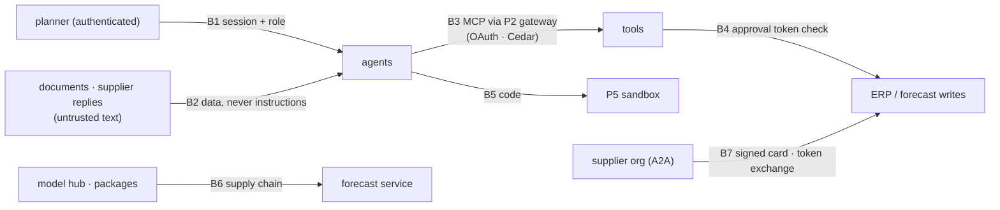

# 5. Security & Threat Model

A planning copilot reads untrusted text (notes, plans, supplier messages) and can **spend money** (orders)
and **change numbers other teams rely on** (forecasts). The threat model is built around those two
powers. Platform threats already covered in Projects 2, 5, 6 and 7 are referenced rather than repeated.

## 5.1 Assets

| Asset | Why it matters |
|---|---|
| Orders and approvals | Direct financial impact; the main target for misuse |
| The published forecast | Drives orders, staffing and supplier commitments across the business |
| Sales, price and promo data | Commercially sensitive per retailer org |
| Planner memory | Shapes future recommendations; a poisoned memory persists |
| Documents (plans, notes) | Untrusted input that the agents read |
| Model weights and code | Supply chain for the forecast service |

## 5.2 Trust boundaries

## 5.3 Threats → controls → tests

| # | Threat | Control | Test |
|---|---|---|---|
| T1 | **Indirect prompt injection** via notes, plans or supplier replies | Tool output labelled as untrusted data; agents can only emit typed actions; bounds and approvals apply whatever the text says | R1, PlanBench injection family |
| T2 | **Excessive agency / runaway orders** | Orders always need a signed approval checked **in the tool**; order maths done in code; per-order and per-day value caps | R2, R3 |
| T3 | **Approval forgery or replay** | JWS approval tokens bound to proposal ID, lines hash, approver and expiry (P3 design); idempotency keys | R3 |
| T4 | **Forecast tampering** (large silent changes) | Typed revision actions with bounds; approval above thresholds; every change in the revision log with author and evidence | Unit tests + R6 |
| T5 | **Fabricated evidence** | Citations must resolve to items retrieved in this session | R6 |
| T6 | **Cross-tenant data access** | Org on every row with Postgres RLS (P6); Cedar policies on every MCP tool (P2); org claim from the token, never from the prompt | R4 |
| T7 | **Memory poisoning** | Only planner-confirmed facts are written; provenance on every memory; memories shown in the UI and deletable | R5 |
| T8 | **Unsafe code execution** | LLM-written code only in the P5 sandbox (no network, no secrets) | R7 (P5 subset) |
| T9 | **Denial of wallet** | P7 virtual keys and budgets per org; per-session step and cost caps in the graph | R8 |
| T10 | **Model and dependency supply chain** | Hash-locked installs and SHA-pinned CI (P7 pattern); model weights pinned by revision hash, `safetensors` only, no `trust_remote_code`; models downloaded at build time | CI supply-chain job |
| T11 | **Rogue supplier agent** | A2A signed Agent Card pinned in the registry (P4); supplier replies can't change orders, only confirmation fields | A2A card tests from P4 |
| T12 | **Data licensing breach** | Raw M5 never committed or served; public demo on CC BY 4.0 data with attribution | Repo check in CI (file hash deny-list) |

## 5.4 Why "the LLM never writes numbers" is also a security control

If an injected note convinces the model to "add 1,000%", the only thing the model can do is propose a
`scale` action. The revision engine rejects factors above 2.0, and anything outside 0.75–1.25 waits for a
human. The same attack on a design where the LLM writes forecast values directly would succeed silently.
Typed actions turn a prompt-injection problem into a **bounded-authorization** problem, which is testable.

## 5.5 Mapping to OWASP

| OWASP LLM (2025) | Covered by |
|---|---|
| LLM01 Prompt injection | T1 |
| LLM02 Sensitive information disclosure | T6 |
| LLM03 Supply chain | T10 |
| LLM04 Data and model poisoning | T7 |
| LLM05 Improper output handling | T4, T5, T8 |
| LLM06 Excessive agency | T2, T3 |
| LLM10 Unbounded consumption | T9 |

| OWASP Top 10 for Agentic Applications (2026) | Covered by |
|---|---|
| ASI01 Agent goal hijack | T1 |
| ASI02 Tool misuse & exploitation | T2, T4 |
| ASI03 Identity & privilege abuse | T3, T6 |
| ASI04 Agentic supply chain | T10 |
| ASI05 Unexpected code execution | T8 |
| ASI06 Memory & context poisoning | T7 |
| ASI07 Insecure inter-agent communication | T11 |
| ASI09 Human–agent trust exploitation | Approval screens show evidence and computed impact, not model-written summaries alone (§5.6) |

## 5.6 Residual risks

- **Bounded but wrong adjustments** inside the no-approval band (±25%) can still hurt accuracy. FVA
  tracking is the control, and the band is a setting a planning lead can tighten.
- **Approval fatigue:** planners who approve everything make approvals meaningless. The UI shows the
  evidence and expected impact next to every approval, and the report tracks approval edit rates.
- **Simulation is not reality:** order results come from a simulator with assumed lead times and costs.
