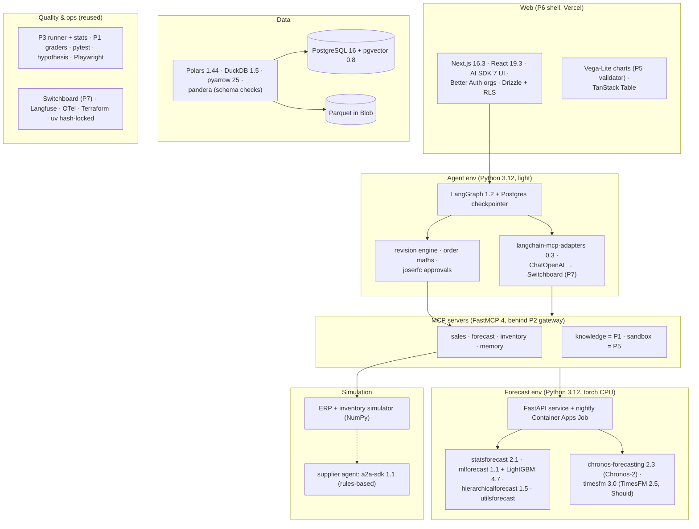

# 8. Tech Stack: What We Use and Why

For every technology in this project, this document answers five questions:
1. **What does it do in this system?**
2. **Why was it chosen?**
3. **What alternatives were considered, and why weren't they chosen?**
4. **What does it add to your profile?**
5. **When would we replace it?**

The capstone reuses most of its platform from Projects 1–7, so this document focuses on what's **new**
(data, forecasting, the revision engine, the simulator) and on **how the reused pieces connect**.

Selection criteria:

| # | Criterion | Meaning |
|---|---|---|
| C1 | **Backtestable** | Every number the system shows can be reproduced and scored on past data |
| C2 | **Reuse** | Prefer the component already built in Projects 1–7 over a new one |
| C3 | **Domain credibility** | Tools that forecasting and planning teams actually use (Nixtla libraries, LightGBM, hierarchical reconciliation) |
| C4 | **Clean licences** | Apache/MIT/BSD code and model weights; data whose terms allow what we do with it |
| C5 | **CPU-first cost** | The demo runs without a GPU; GPU time is optional and one-off |
| C6 | **Market value** | Forecasting foundation models, agentic planning and evaluation appear in 2026 JDs (see [01-market-analysis](../../../01-market-analysis.md)) |

---

## 8.1 The stack at a glance

Three separate Python environments keep heavy dependencies where they belong: **forecast** (torch,
transformers), **agents + MCP** (no torch), and **evals**. Each is hash-locked with uv, as in Project 7.

## 8.2 Summary table

| Layer | Choice | One-line reason | Main alternative (not chosen) |
|---|---|---|---|
| Evaluation data | **M5** via the official **Kaggle CLI 2.2** (your own account) | The benchmark everyone knows; provenance recorded, raw files never committed | Third-party mirrors (unclear provenance and terms) |
| Demo data | **FreshRetailNet-50K** subset via **huggingface-hub** | CC BY 4.0; promotions, weather, stockout labels | Synthetic data only (less credible) |
| ETL / features | **Polars 1.44 + DuckDB 1.5**, Parquet via **pyarrow 25**, **pandera** schema checks | Fast on 30k series × 1,941 days on a laptop | pandas-only (slower on the full M5), Spark (overkill) |
| Statistical baselines | **statsforecast 2.1** (SeasonalNaive, AutoETS, Theta, CrostonOptimized, TSB) | Fast per-series models built for thousands of series | statsmodels loops (much slower) |
| Global ML model | **mlforecast 1.1 + LightGBM 4.7** (Tweedie; quantile models) | The approach behind strong M5 results; lag/rolling features handled consistently | Darts or sktime wrappers (more abstraction than needed) |
| Foundation model | **Chronos-2** via **chronos-forecasting 2.3** (CPU torch 2.14) | Leads pretrained models on fev-bench and GIFT-Eval; covariates via group attention; Apache-2.0 | Moirai 2 (less covariate support), TiRex (licence, ADR-003) |
| Second TSFM (Should) | **TimesFM 2.5** via **timesfm 3.0**, univariate | Google's model, the usual comparison | Toto (built for observability data) |
| Reconciliation | **hierarchicalforecast 1.5** (MinT shrink) | Standard, tested implementation of optimal reconciliation | Hand-written bottom-up only |
| Metrics | **utilsforecast** losses + our **WRMSSE** checked against the official M5 evaluator | Planner metrics plus the competition metric | fev (a benchmark harness; used only as a cross-check) |
| Tuning | **Optuna 5** (small budget, validation origin only) | Enough for LightGBM; no leakage into test | Grid search |
| Forecast service | **FastAPI 0.141** + **Container Apps Job** for nightly runs | Same service pattern as earlier projects | Airflow/Dagster (one nightly job doesn't need an orchestrator) |
| Run tracking | **Postgres tables** (`forecast_run`, model cards with data hash and code version) | Queryable next to forecasts and revisions | MLflow 3 (another service to run for one model family) |
| Agents | **LangGraph 1.2.12** + **langgraph-checkpoint-postgres 3.1** | Supervisor, interrupts and checkpoints from Project 3 | OpenAI Agents SDK / Claude Agent SDK (all three compared in P3; swap in P3's winner if it isn't LangGraph) |
| Model access | **langchain-openai 1.6** `ChatOpenAI` pointed at **Switchboard** | One OpenAI-compatible endpoint, budgets and ledger (P7) | Direct provider SDKs (no cost ledger) |
| MCP servers | **FastMCP 4.0**, behind the **P2 gateway** (OAuth, **cedarpy 4.12**) | Same stack and policy engine as Project 2 | Direct function tools (no role-based access, no reuse) |
| Approvals | **joserfc 1.7** JWS tokens (P3 design) | Signed, scoped, expiring approvals checked in tools | Boolean "approved" flags (forgeable by the agent) |
| Memory | **memory-mcp** (P3 design): Postgres + pgvector + full-text search | Builds the piece P3 deferred, with a strict write policy | Mem0/Zep (less control over the write policy) |
| Knowledge | **P1's RAG pipeline** as `knowledge-mcp` | Citations and evals already exist | New RAG stack |
| Sandbox | **P5 broker** via MCP (`run_python`, `run_sql`) | Only LLM-written code goes there | Running agent code in the agent process (unsafe) |
| Supplier agent | **a2a-sdk 1.1.5**, deterministic rules with a seed | A2A reuse from P4; reproducible simulation | An LLM supplier (adds noise, not realism) |
| Simulator | **NumPy / Polars**, in-house | Simple daily loop; easy to audit | SimPy (event scheduling not needed for a daily loop) |
| Web | **P6 shell**: Next.js 16.3, AI SDK 7, Better Auth 1.7, Drizzle; **P5 Vega-Lite** charts | Orgs, RLS and safe charts already built | Streamlit (fast, but not the full-stack story) |
| Agent ↔ UI stream | The agent service emits the **AI SDK UI message stream** (typed data parts) | `useChat` and typed parts work unchanged | AG-UI protocol via CopilotKit (good LangGraph support; a second UI framework) |
| Observability | **Langfuse 4.15** + OTel GenAI spans; **P7** ledger for cost | Same traces as every project; cost per session for free | Separate APM |
| Infra | **Terraform → Azure Container Apps (+ Jobs)**, existing Postgres and Blob; **Vercel** for web | Reuses modules from P1–P7 | AKS |

---

## 8.3 Detailed rationale

### Data

#### M5 through the official Kaggle download
- **Role:** Evaluation data for backtests, PlanBench-60 and the replenishment simulation.
- **Why:** It's the dataset forecasting people know (C3), with prices, events, SNAP days and a 12-level
  hierarchy.
- **Watch:**
  - Read the competition's data-use rules when you download, and record the decision in
    `data/PROVENANCE.md`. The design assumes **no redistribution**: raw files and row-level derivatives stay
    out of the repo and the public demo (ADR-004). A CI check fails on known M5 file hashes.
  - Use the official Kaggle download, not mirrors, so provenance is clean.
- **Revisit:** If the rules clearly allow redistribution of derived aggregates, the demo could show M5
  charts too.

#### FreshRetailNet-50K for the public demo
- **Role:** A subset (≈ 2,000 store-product series, daily aggregation of the hourly data) seeds the public
  demo, with attribution.
- **Why:** CC BY 4.0 (C4). It has discounts, weather and **stockout labels**, which the M5 data doesn't.
- **Watch:** Pin the dataset revision on the Hub. Aggregate hourly → daily in the loader and keep the
  stockout share per day as a covariate.

#### Polars + DuckDB + Parquet, pandera checks
- **Role:** Load, clean and reshape into the canonical long format (`series_id, ds, y` + covariates);
  build the calendar and price tables; write Parquet snapshots with a data hash.
- **Why:** The full M5 in long format is ~59 million rows. Polars and DuckDB handle that on one machine.
- **Watch:**
  - Nixtla libraries accept pandas and (for some) Polars inputs. **hierarchicalforecast's Polars extra
    pins `polars<=1.32`**, so hand it pandas frames instead of installing that extra.
  - pandas is at 3.0: confirm the Nixtla libraries' pandas 3 support in the first spike (§8.6).

### Forecasting

#### statsforecast baselines
- **Role:** `snaive`, `ets`, `theta`, `croston_tsb`: the floor every other model must beat.
- **Why:** Vectorised and parallel across thousands of series; the de facto open-source standard (C3).

#### mlforecast + LightGBM (the global model)
- **Role:** One model across all series with lags, rolling means, calendar, price, event and SNAP
  features; a Tweedie objective for zero-heavy sales; quantiles via separate quantile objectives or
  conformal intervals, whichever calibrates better on the validation origin.
- **Why:** Gradient-boosted global models were the backbone of strong M5 solutions (C3).
- **Watch:** Recursive vs direct multi-step strategies change accuracy over 28 days; test both on the
  validation origin.

#### Chronos-2 (chronos-forecasting 2.3)
- **Role:** Zero-shot probabilistic forecasts with **past and known-future covariates** (price, events,
  SNAP) through group attention, and the scenario engine for "what if the price drops 10%?".
- **Why:** It leads pretrained models on fev-bench and GIFT-Eval in 2025–26 and handles covariates
  natively (C6). Apache-2.0 code and weights (C4).
- **Watch:**
  - The package requires **`transformers<6`**; keep it in the forecast environment only.
  - **CPU throughput decides the M5 scope** (all series vs a 3,000-series sample). Measure it in week 1.
  - Pin the model by **revision hash**, load `safetensors` only, never `trust_remote_code`, and bake the
    weights into the image (threat T10).
  - Scenario covariates must be in-distribution: a 90% price cut is outside anything seen. The UI caps
    slider ranges to what the data contains.
- **Not chosen:** TiRex (strong results, but the NXAI Community License isn't a standard open-source
  licence); fine-tuning Chronos-2 (a Could; zero-shot first).

#### TimesFM 2.5 (Should)
- **Role:** A second foundation model in the comparison, **univariate only**.
- **Watch:** The `timesfm` package's covariate path (`xreg` extra) pulls in JAX with CUDA. That's too
  heavy for a CPU-first comparison, so TimesFM runs without covariates, and the report says so.

#### hierarchicalforecast (MinT)
- **Role:** Reconcile across item → dept → category → store → state → total, for the nightly run and after
  each accepted revision (on the affected branch).
- **Watch:** Check which probabilistic reconciliation methods the current version supports for quantiles
  (§8.6). Fallback: reconcile the median and scale quantiles proportionally, and say so.

#### Metrics: utilsforecast + our WRMSSE
- **Role:** WAPE, MASE, bias and quantile loss from utilsforecast; WRMSSE implemented in the repo.
- **Watch:** WRMSSE is easy to get subtly wrong. Validate it against the **official M5 evaluation** on a
  published submission or known values before trusting any headline number.

### Agents and tools

#### LangGraph 1.2 (+ Postgres checkpointer)
- **Role:** The supervisor/specialist graph, the single-agent baseline, interrupts for approvals, and
  resume after crashes.
- **Why:** It's the dominant agent-orchestration ask in the JDs (C6), and Project 3 builds the same
  interrupt/checkpoint patterns on it (C2). If P3's comparison favours another framework for this kind of
  workflow, that result wins and this choice is revisited.
- **Watch:** Keep node logic thin; the revision engine and order maths are plain Python functions with
  their own property tests, called from nodes.

#### Models through Switchboard
- **Role:** `ChatOpenAI(base_url=<Switchboard>, api_key=<org virtual key>)` with aliases: `fast` for the
  supervisor, `smart` for the Forecast Reviewer and Analyst.
- **Why:** Budgets, fallbacks, prompt caching and the cost ledger come from P7 (ADR-012).
- **Watch:** Structured outputs (the revision-action schema) must survive the gateway's translation to
  Anthropic. The P7 contract tests cover this; add a revision-action case to them.

#### FastMCP 4 servers behind the P2 gateway
- **Role:** `sales-mcp`, `forecast-mcp`, `inventory-mcp`, `memory-mcp` as small FastMCP servers; Cedar
  policies by role (viewer, planner, category manager, supply planner) in the P2 gateway.
- **Why:** Same protocol version, auth and policy stack as P2 (C2). The capstone's policies become a
  second real-world Cedar example.

#### joserfc approval tokens
- **Role:** JWS tokens binding approver, proposal ID, lines hash and expiry; verified inside
  `submit_order` and `accept_revision`.
- **Why:** P3's design, reused. The agent never holds a signing key.

#### Supplier agent (a2a-sdk 1.1, rules-based)
- **Role:** Receives POs, confirms, part-fills or delays by seeded rules per supplier (fill-rate and
  lead-time distributions).
- **Why:** A2A reuse from P4 with a **deterministic** counterpart, so simulations are reproducible.

### Web

- **P6 shell:** Next.js 16.3, React 19.3, AI SDK 7 UI, Better Auth organizations, Drizzle with RLS.
- **Charts:** forecast fans (quantile bands), before/after overlays and FVA trends as Vega-Lite specs,
  validated by P5's restricted-subset validator and rendered with `vega-interpreter` (CSP without
  `unsafe-eval`).
- **Agent stream:** the Python agent service emits the AI SDK UI message stream with **typed data parts**
  (`revision-preview`, `order-proposal`, `approval-request`, `cost`), so the React side uses `useChat`
  unchanged. Verify the protocol against AI SDK 7's docs in the first spike; fall back to AG-UI if it
  doesn't fit.
- **Exceptions table:** TanStack Table (as P6).

### Evaluation, ops and supply chain

- **P3 runner + statistics** for PlanBench-60 (k = 3, pass^k, bootstrap CIs); **P1 graders** for the
  knowledge set; pytest + hypothesis for the revision engine and order maths; Playwright for the approval
  flow.
- **Langfuse** traces with P3's span names; **Switchboard** ledger for cost per session.
- **Supply chain (P7 controls):** uv hash-locked installs, SHA-pinned actions, zizmor, the `.pth` check,
  pip-audit and guarddog; model weights pinned by revision and baked into the forecast image.
- **Infra:** Terraform to Container Apps (agent service, MCP servers, forecast service, supplier agent)
  and **Container Apps Jobs** (nightly forecast, simulation); existing Postgres and Blob; Vercel for web.

---

## 8.4 What this stack adds to your profile

| New on your profile after this project | Evidence produced |
|---|---|
| Time-series foundation models in a real forecasting pipeline (Chronos-2, TimesFM) | Backtest report vs statistical and ML baselines |
| Hierarchical, probabilistic retail forecasting at M5 scale | WRMSSE, quantile loss, reconciliation on/off |
| LLM agents for last-mile forecast adjustment, measured with FVA | PlanBench-60 report, harmful-adjustment rate |
| Decision evaluation (replenishment simulation) | Fill rate vs cost curves by forecast source |
| A multi-agent system built on your own platform (MCP, A2A, sandbox, gateway) | Architecture + integration tests |
| Domain-grounded safety: bounded actions, signed approvals, poisoning defences | Red-team R1–R8 results |

**Deliberately not in this project:**
- Fine-tuning or training forecasting foundation models.
- A real ERP, multi-echelon optimization and price optimization.
- A workflow orchestrator (one nightly job doesn't need one).

## 8.5 Version baseline (September 2026)

| Component | Version | Needed for |
|---|---|---|
| Python / uv | 3.12 / 0.12 | Three hash-locked environments |
| polars / duckdb / pyarrow / pandas | 1.44 / 1.5 / 25 / 3.0 | ETL, features, Nixtla inputs |
| pandera | 0.33 | Schema checks on loaded data |
| kaggle / huggingface-hub | 2.2 / 2.0 | M5 download (own account) / FreshRetailNet-50K |
| statsforecast / mlforecast / hierarchicalforecast / utilsforecast | 2.1 / 1.1 / 1.5 / 0.2 | Baselines, global model, reconciliation, metrics |
| lightgbm / optuna | 4.7 / 5.0 | Global model, tuning |
| chronos-forecasting / torch (CPU) / transformers | 2.3 / 2.14 / 5.x (< 6) | Chronos-2 |
| timesfm | 3.0 (Should) | TimesFM 2.5, univariate |
| fastapi / pydantic | 0.141 / 2.13 | Forecast service, schemas |
| langgraph / langgraph-checkpoint-postgres / langchain-mcp-adapters / langchain-openai | 1.2.12 / 3.1 / 0.3 / 1.6 | Agents |
| fastmcp / cedarpy / joserfc | 4.0 / 4.12 / 1.7 | MCP servers, policies, approvals |
| a2a-sdk | 1.1.5 | Supplier agent |
| langfuse | 4.15 | Traces |
| PostgreSQL / pgvector | 16 / 0.8 | Canonical data, forecasts, revisions, memory |
| Next.js / React / ai / better-auth | 16.3 / 19.3 / 7.0 / 1.7 | Web (as P6) |
| vega / vega-lite / vega-embed / vega-interpreter | 6.4 / 6.4 / 7.3 / 2.3 | Charts (as P5) |

## 8.6 Things to verify in the first week of building

| Item | Why | Fallback |
|---|---|---|
| Kaggle M5 data-use rules, read and recorded in `PROVENANCE.md` | ADR-004 | If stricter than assumed, keep M5 results as aggregate metrics only |
| Chronos-2 CPU throughput on 1,000 series × 28 days with covariates | Decides M5 scope and scenario latency | Rented GPU for backtests; LightGBM-based scenarios |
| Nixtla libraries with pandas 3 (and hierarchicalforecast without the Polars extra) | Everything downstream | Pin pandas 2.x in the forecast environment only |
| Our WRMSSE matches the official M5 evaluation on a known submission | Headline metric correctness | Port the official evaluation code directly |
| hierarchicalforecast probabilistic reconciliation for quantiles | Consistent bands | Reconcile medians, scale quantiles, document it |
| LangGraph agent service → AI SDK 7 UI message stream with typed data parts | Workspace UI | AG-UI protocol (CopilotKit) |
| Revision-action structured output through Switchboard on both providers | ADR-001 + ADR-012 | Tool-forced JSON with schema validation |
| P2 gateway + Cedar policies with the four capstone roles | Role-based tools | Per-server role checks (weaker, noted) |
| TimesFM 3.0 package loads the 2.5 checkpoint on CPU | Should-level comparison | Drop TimesFM; report Chronos-2 only |
| FreshRetailNet-50K revision pinned; hourly → daily aggregation checked against the paper's stats | Demo data correctness | Smaller subset |
