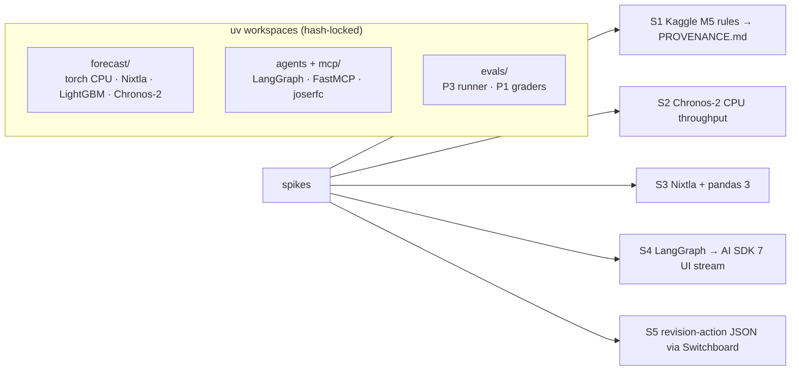

# F0: Foundation & Spikes

| Milestone | Priority | Depends on | Effort | Unblocks |
|---|---|---|---|---|
| M1 | Must | — | 4 h | F1 |

**Goal:** The `cadence/` repo with three hash-locked Python environments, the web workspace skeleton from
P6's packages, Docker Compose, CI with P7's supply-chain controls, and five spikes on the riskiest
assumptions from the [tech stack](../08-tech-stack.md#86-things-to-verify-in-the-first-week-of-building).

## Diagram: environments and spikes



## Deliverables / files
```
forecast/pyproject.toml · agents/pyproject.toml · evals/pyproject.toml   # three uv projects, locked
web/                                   # P6 shell packages (auth, layout, AI Elements)
infra/compose.yaml                     # postgres+pgvector, forecast svc, agent svc, MCP servers
.github/workflows/ci.yml               # SHA-pinned actions, supply-chain job (P7 pattern)
scripts/check_no_m5.py                 # fails if known M5 file hashes are committed
data/PROVENANCE.md
spikes/S1…S5.md                        # decision notes
```

## Tasks
- [ ] Repo layout from [02 §2.9](../02-architecture.md#29-proposed-repository-layout); three locked environments
- [ ] CI: lint, types, tests per environment; P7 supply-chain job; `check_no_m5.py`
- [ ] **S1:** read the Kaggle M5 data-use rules; record what's allowed in `PROVENANCE.md`
- [ ] **S2:** Chronos-2 on 1,000 series × 28 days with covariates on 4 vCPU; decide all-series vs a 3,000-series sample
- [ ] **S3:** statsforecast, mlforecast and hierarchicalforecast on pandas 3 (pin pandas 2.x in `forecast/` if not)
- [ ] **S4:** a LangGraph node streams text and one typed data part to `useChat` via the AI SDK 7 UI message stream
- [ ] **S5:** the revision-action schema as structured output through Switchboard on both providers

## Acceptance criteria
- All three environments install from lockfiles with hashes in CI
- Each spike has a written decision (keep, fallback, or change the design)

## Tests
- `check_no_m5.py` unit test with a fake hash list

**Interview talking point:** *"Before writing any forecasting code I checked the three things that could
sink the project: the data licence, whether the foundation model runs fast enough on a CPU, and whether my
Python agents could stream typed UI to the React front end."*
