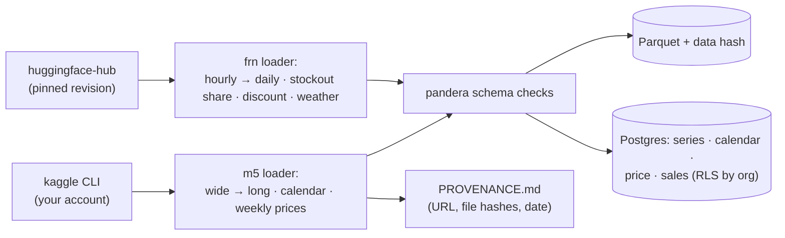

# F1: Data Platform (M5, FreshRetailNet, Canonical Schema)

| Milestone | Priority | Depends on | Effort | Unblocks |
|---|---|---|---|---|
| M1 | Must | F0 | 5 h | F2, F7, F8 |

**Goal:** Both datasets loaded into one **canonical schema** ([03 §3.1](../03-low-level-design.md#31-canonical-data-model))
as Parquet snapshots (with a data hash) and Postgres tables with RLS for two fictional retailer orgs.

## Diagram: loaders



## Deliverables / files
```
data/loaders/m5.py                 # Polars; 30,490 series × 1,941 days → long format
data/loaders/frn50k.py             # subset selection (≈ 2,000 series), hourly → daily
data/schema.py                     # pandera schemas for series, calendar, price, sales
data/snapshots.py                  # Parquet + sha256 manifest
migrations/                        # canonical tables, org column, RLS policies (P6 pattern)
data/seed_orgs.yaml                # "north" (M5 CA stores, local only) and "demo" (FRN subset, public)
```

## Tasks
- [ ] M5 loader: melt sales, join calendar (events, SNAP) and weekly prices; hierarchy columns
- [ ] FreshRetailNet loader: pinned revision, subset by city and category, daily aggregation, stockout share covariate
- [ ] pandera checks: no negative sales, complete calendars, price coverage, unique keys
- [ ] Snapshots with data hash (used by every forecast run and report)
- [ ] Postgres tables with `org` and RLS; two orgs seeded; attribution text for FreshRetailNet

## Acceptance criteria
- M5 long table has 30,490 × 1,941 rows (≈ 59.2 M) and the 12-level hierarchy reproduces the competition's 42,840 series count
- RLS test: org "demo" can't read org "north" rows

## Tests
- Schema tests on both loaders; hierarchy count test; RLS test

**Interview talking point:** *"Both datasets go into one canonical schema, so everything downstream is
dataset-agnostic. M5 stays local because of its terms; the public demo runs on a CC BY dataset that also
labels stockouts, which M5 can't."*
