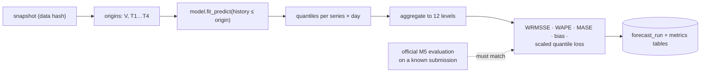

# F2: Baselines & Backtest Harness

| Milestone | Priority | Depends on | Effort | Unblocks |
|---|---|---|---|---|
| M1 | Must | F1 | 4.5 h | F3, F4 |

**Goal:** A rolling-origin backtest harness (1 validation + 4 test origins × 28 days) with the metrics from
[04 §4.1](../04-evaluation-design.md#41-forecast-accuracy-backtests), and the statistical baselines run
through it. **WRMSSE is validated against the official M5 evaluation before anything else is recorded.**

## Diagram: harness



## Deliverables / files
```
forecast/backtest/origins.py      # origin dates; history cut-offs; no future leakage
forecast/backtest/run.py          # model registry, fit/predict, store results
forecast/metrics/wrmsse.py        # weights from the last 28 days' dollar sales, per the M5 guide
forecast/metrics/basic.py         # WAPE, MASE, bias, pinball / scaled quantile loss
forecast/models/stats.py          # SeasonalNaive, AutoETS, Theta, CrostonOptimized, TSB (statsforecast)
```

## Tasks
- [ ] Origins and leakage guard (assert max training date < origin)
- [ ] WRMSSE implementation; **validate against the official evaluation on a known submission**
- [ ] Statistical baselines with statsforecast (parallel); intermittent series routed to Croston/TSB
- [ ] Results stored per series, level, model, origin; a summary table by series class (fast vs intermittent)

## Acceptance criteria
- Our WRMSSE equals the official value on the reference submission (to 4 decimal places)
- Baselines for all 30,490 series on 5 origins finish in under an hour on one machine

## Tests
- Leakage test; metric unit tests on hand-computed toy series; hierarchy aggregation test

**Interview talking point:** *"The first number I trusted was the metric itself: I checked my WRMSSE
against the official M5 evaluation before recording a single result."*
