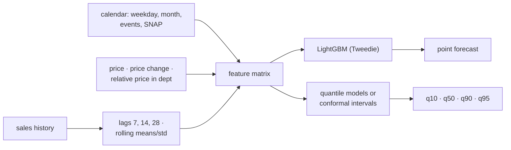

# F3: LightGBM Global Model

| Milestone | Priority | Depends on | Effort | Unblocks |
|---|---|---|---|---|
| M1 | Must | F2 | 4.5 h | F5 |

**Goal:** One LightGBM model across all series via mlforecast, with calendar, price, event and SNAP
features, a Tweedie objective, and calibrated quantiles, tuned on the validation origin only.

## Diagram: features and outputs



## Deliverables / files
```
forecast/models/lgbm.py          # mlforecast pipeline, recursive and direct variants
forecast/models/quantiles.py     # quantile objectives vs conformal, chosen on validation
forecast/tune/optuna_lgbm.py     # ≤ 40 trials on the validation origin
```

## Tasks
- [ ] Features: lags, rolling stats, calendar, events, SNAP, price and price-change features
- [ ] Tweedie objective; compare recursive vs direct multi-step on validation
- [ ] Quantiles: separate quantile models vs conformal intervals; pick by coverage and quantile loss
- [ ] Optuna tuning on the validation origin only; freeze; run test origins once

## Acceptance criteria
- Beats `ets` and `snaive` on WRMSSE across test origins (or the report explains why not)
- 90% interval coverage within ±5 points of nominal on validation

## Tests
- Feature leakage test (no feature uses data after the origin); reproducibility from seed + data hash

**Interview talking point:** *"The global LightGBM model is the pattern behind strong M5 results: one
model across thousands of series, lag and price features, and a Tweedie loss because most item-store days
sell zero."*
