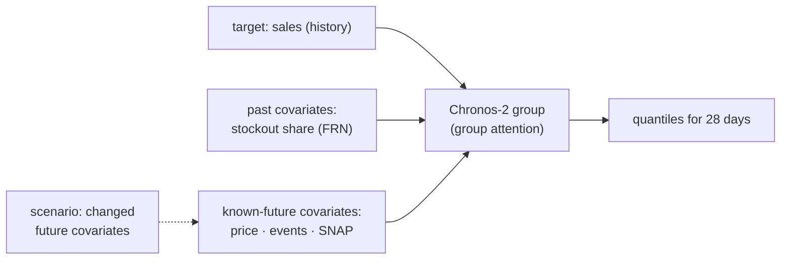

# F4: Chronos-2 (and TimesFM 2.5)

| Milestone | Priority | Depends on | Effort | Unblocks |
|---|---|---|---|---|
| M1 | Must | F2 | 4 h (5.5 with TimesFM; +1 GPU full-M5 run) | F5 |

**Goal:** Chronos-2 zero-shot forecasts with past and known-future covariates through the backtest
harness, on all series or the stratified sample chosen in spike S2, and the scenario function the forecast
service will expose.

## Diagram: covariate groups



## Deliverables / files
```
forecast/models/chronos2.py      # pinned revision, safetensors, batch inference, CPU threads
forecast/models/timesfm25.py     # (deferred) univariate comparison
forecast/models/sample.py        # stratified 3,000-series sample (by dept × velocity class), fixed seed
Dockerfile.forecast              # weights baked in at build time with checksum
```

## Tasks
- [ ] Load Chronos-2 by revision hash; `safetensors` only; no remote code
- [ ] Batch inference with covariates; tune batch size and threads on CPU
- [ ] Run on the chosen scope (all series, or the stratified sample shared by every model's comparison)
- [ ] Scenario function: same context, changed future covariates, returns a new quantile set
- [ ] (Deferred) TimesFM 2.5 univariate; full-M5 run on a rented GPU

## Acceptance criteria
- Results stored in the same tables as F2/F3 so the report compares like with like
- Scenario for 200 series in ≤ 5 s on the service's CPU (or the LightGBM fallback is wired)

## Tests
- Determinism check (same inputs → same quantiles); quantile monotonicity; scenario changes only affected series

**Interview talking point:** *"Chronos-2 takes known-future covariates like price and events, which is
what makes 'what if we cut the price 10%?' a real forecast rather than a guess. I measured where it beats
the LightGBM model and where it doesn't, especially on intermittent series."*
