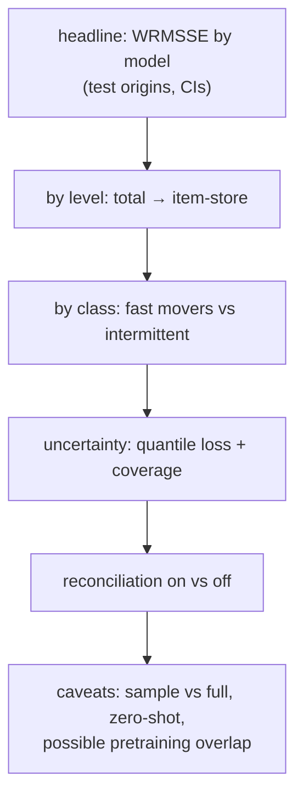

# F6: Forecast Report

| Milestone | Priority | Depends on | Effort | Unblocks |
|---|---|---|---|---|
| M1 | Must | F5 | 2.5 h | F19 |

**Goal:** A standalone report of the backtests: every model on every metric, by hierarchy level and
series class, with and without reconciliation, with bootstrap CIs and honest caveats.

## Diagram: report sections



## Deliverables / files
```
evals/forecast_report/build.py      # regenerates tables + charts from stored runs
reports/forecast-report.md
```

## Tasks
- [ ] Tables and charts from stored runs only (one command regenerates everything)
- [ ] Block bootstrap over series for CIs; pairwise comparisons vs `ets`
- [ ] Caveats: sample scope (if used), zero-shot vs trained, pretraining-data overlap for foundation models
- [ ] One LinkedIn-ready finding (e.g. where Chronos-2 beats LightGBM and where it doesn't)

## Acceptance criteria
- Every number traces to a `forecast_run` ID and data hash

## Tests
- Report build in CI on a small fixture

**Interview talking point:** *"The forecast report stands on its own before any agent is involved. That
matters, because FVA only means something if the baseline is strong."*
