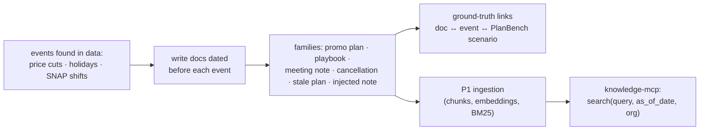

# F7: Document Corpus & Knowledge Tool

| Milestone | Priority | Depends on | Effort | Unblocks |
|---|---|---|---|---|
| M2 | Must | F1 | 4 h | F10, F15 |

**Goal:** The documents a planner would have had: fictional promo plans, category playbooks and meeting
notes, each **dated** and tied to real events in the data, ingested into **P1's RAG pipeline** and exposed
as `knowledge-mcp` with date filters.

## Diagram: corpus construction



## Deliverables / files
```
docs-corpus/north/*.md · docs-corpus/demo/*.md   # front matter: id, org, doc_date, type, series scope
docs-corpus/ground_truth.yaml                     # which event each doc describes (never shown to agents)
docs-corpus/rules.md                              # writing rules: only information known before doc_date
mcp/knowledge/server.py                           # thin FastMCP wrapper over P1's retriever
```

## Tasks
- [ ] Find candidate events in the data (price drops, holidays, SNAP) for PlanBench windows
- [ ] Write ~80 short documents across the six families, obeying `rules.md` (no future information)
- [ ] Label all documents as fictional; attribution for dataset facts
- [ ] Ingest with P1; add an `as_of_date` filter so agents only see documents dated before the forecast origin
- [ ] Peer-check 10 documents against the leakage rules (ask a friend, or re-read cold after a day)

## Acceptance criteria
- `search` with `as_of_date` never returns a document dated after it
- Every PlanBench scenario has its documents in the corpus with ground-truth links

## Tests
- Date-filter test; citation IDs resolve via `get_chunk`

**Interview talking point:** *"The hardest part of evaluating a planning copilot is the documents. I wrote
them so they only contain what a planner could have known before the forecast date, including cancelled
and stale plans, so the benchmark checks judgement, not reading comprehension."*

**Stub if P1 isn't ready:** pgvector + full-text search over the chunks directly (no reranker).
