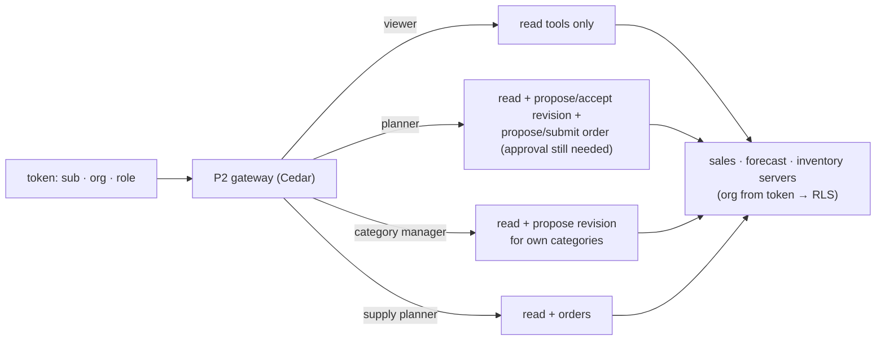

# F8: MCP Servers & Role Policies

| Milestone | Priority | Depends on | Effort | Unblocks |
|---|---|---|---|---|
| M2 | Must | F1, F5 | 4.5 h | F10, F11, F12 |

**Goal:** `sales-mcp`, `forecast-mcp` and `inventory-mcp` (read tools now, order tools finished in F11) as
FastMCP 4 servers behind the **P2 gateway**, with Cedar policies for four roles and the tool catalog in
[03 §3.5](../03-low-level-design.md#35-mcp-tool-catalog).

## Diagram: role policies



## Deliverables / files
```
mcp/sales/server.py        # get_sales, top_errors, describe_hierarchy
mcp/forecast/server.py     # get_forecast, scenario, find_analogs, propose_revision, accept_revision (F9 wires these)
mcp/inventory/server.py    # get_position (F11 adds propose_order, submit_order)
policies/cadence.cedar     # roles × tools × resource scope (org, category)
policies/tests/            # Cedar policy tests
```

## Tasks
- [ ] Three servers with typed inputs/outputs and tool annotations (read-only vs destructive)
- [ ] Register with the P2 gateway; Keycloak client and roles for the capstone realm
- [ ] Cedar policies: role × tool × scope (a category manager only touches their categories)
- [ ] Org always from the token; Postgres session variable for RLS (P6 pattern)
- [ ] Tool results labelled as data (document text wrapped as untrusted)

## Acceptance criteria
- A viewer token can't call `propose_revision`; a category manager can't touch another category
- Cross-org read returns 0 rows even with a forged org argument

## Tests
- Cedar policy tests; MCP contract tests; RLS test through the tools

**Interview talking point:** *"The copilot's tools sit behind the same MCP gateway and Cedar policies as my
MCP project, so role checks live in one place, not in prompts."*

**Stub if P2 isn't ready:** servers called directly with a local JWT check and the same Cedar policies
evaluated in-process via `cedarpy`.
