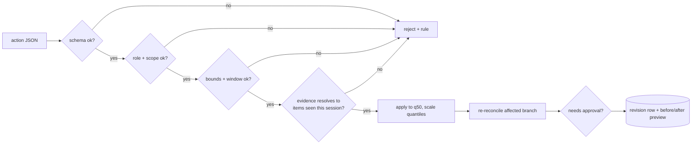

# F9: Revision Engine

| Milestone | Priority | Depends on | Effort | Unblocks |
|---|---|---|---|---|
| M2 | Must | F5 | 4 h | F10 |

**Goal:** The only path by which anything changes a forecast: typed revision actions validated, applied,
re-reconciled and logged, following the seven rules in
[03 §3.3](../03-low-level-design.md#33-revision-actions-the-only-way-agents-change-a-forecast).

## Diagram: validation pipeline



## Deliverables / files
```
agents/revision/actions.py       # pydantic models: scale, shift, override, cap, floor, no_change
agents/revision/engine.py        # validate → apply → reconcile → approval decision → log
agents/revision/evidence.py      # checks citations against the session's tool-call log
agents/revision/config.yaml      # bounds and approval thresholds per org
```

## Tasks
- [ ] Action models with strict schemas (no extra fields)
- [ ] Bounds, windows (inside horizon, not in the past), and role scope checks
- [ ] Evidence check against the session's tool-call log (IDs must have been returned by a tool)
- [ ] Apply to the median, scale quantiles, keep them monotonic; re-reconcile via the forecast service
- [ ] Approval decision (factor outside 0.75–1.25, any override, > 5% at category level)
- [ ] Revision rows and previews; human revisions use the same engine

## Acceptance criteria
- An action citing a document the agent never retrieved is rejected with `evidence_required`
- Applied revisions keep the hierarchy consistent and quantiles ordered

## Tests
- Hypothesis: any accepted action keeps sums and quantile order; bounds never exceeded; `no_change` changes nothing

**Interview talking point:** *"The revision engine is 300 lines of plain Python with property tests, and
it's the reason I can let an LLM near a forecast: whatever the model says, the change is typed, bounded,
evidenced and logged."*
