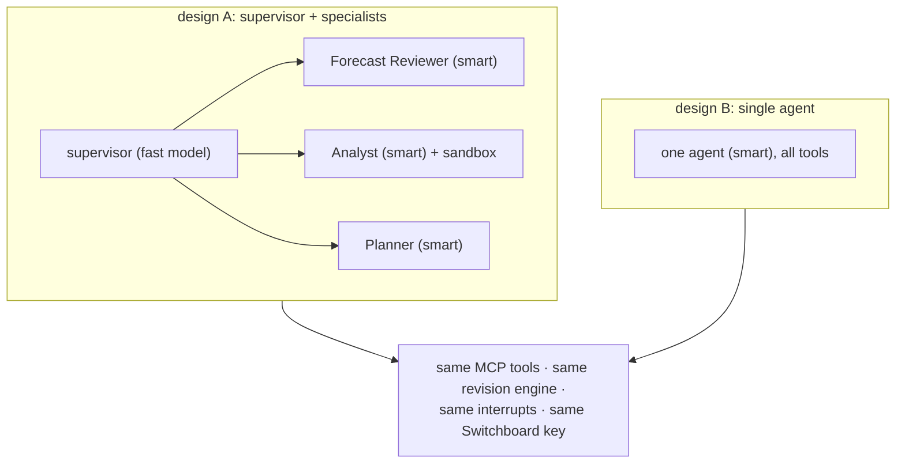

# F10: Agent Graph (Supervisor, Specialists, Single-Agent Baseline)

| Milestone | Priority | Depends on | Effort | Unblocks |
|---|---|---|---|---|
| M2 | Must | F7, F8, F9 | 5.5 h | F14, F15, F18 |

**Goal:** The LangGraph supervisor with the Forecast Reviewer, Analyst and Planner specialists
([02 §2.5](../02-architecture.md#25-the-agent-graph)), plus a **single-agent baseline** with the same
tools, both with Postgres checkpoints, interrupts and model calls through Switchboard.

## Diagram: the two designs



## Deliverables / files
```
agents/graph/state.py          # PlanningState (03 §3.6)
agents/graph/supervisor.py
agents/graph/specialists/      # reviewer.py, analyst.py, planner.py (prompts + tool subsets)
agents/graph/single.py         # baseline design
agents/graph/interrupts.py     # approval interrupts; resume with Command
agents/service/app.py          # FastAPI; AI SDK UI message stream with typed data parts (S4)
agents/prompts/                # versioned prompts; untrusted-data wrapping for tool output
```

## Tasks
- [ ] State, checkpointer, per-session step and cost caps
- [ ] Reviewer: search → analogs → propose actions (or `no_change`) with evidence
- [ ] Analyst: error and driver explanations; code only via P5 `run_python`
- [ ] Planner: calls F11's order maths; explains service-level choices; never edits quantities itself
- [ ] Single-agent baseline with identical tools and caps
- [ ] Streaming endpoint with typed parts (`revision-preview`, `order-proposal`, `approval-request`, `cost`)

## Acceptance criteria
- Both designs complete a review of one slice end to end from the CLI
- Every model call has a Switchboard request ID and cost in the trace

## Tests
- Trajectory assertions on 5 smoke scenarios (right tools, no action without evidence); interrupt/resume test

**Interview talking point:** *"I built the multi-agent design and a single agent with exactly the same
tools, because 'multi-agent' is a cost you should have to justify with numbers."*

**Stubs:** without P5, the Analyst answers from tool data only; without P7, a direct provider key with a
local cost counter.
