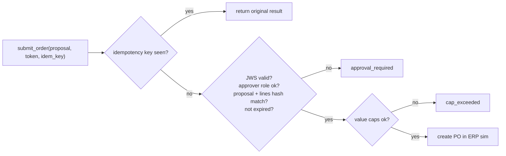

# F11: Orders, Approvals & Simulated ERP

| Milestone | Priority | Depends on | Effort | Unblocks |
|---|---|---|---|---|
| M2 | Must | F5, F8 | 4.5 h | F13, F14, F16, F18 |

**Goal:** The order policy maths ([03 §3.7](../03-low-level-design.md#37-order-policy-planner-agents-calculation-done-in-code)),
signed approvals checked **inside the tool**, idempotent submission, and the ERP/inventory simulator
([03 §3.9](../03-low-level-design.md#39-replenishment-simulator)).

## Diagram: submit_order checks



## Deliverables / files
```
sim/policy.py            # order-up-to from sampled demand over L+R; case packs; MOQ
sim/erp.py               # positions, open orders, receipts, daily step
sim/costs.yaml           # holding, lost-sale, order costs; lead times; supplier fill rates
mcp/inventory/orders.py  # propose_order, submit_order (token + idempotency), value caps
agents/approvals/        # issue tokens from the workspace (F14); joserfc keys in Key Vault
```

## Tasks
- [ ] Order maths with sampling over the forecast distribution (not summed quantiles)
- [ ] Approval tokens (P3 design): approver, proposal ID, lines hash, expiry; issued only by the workspace backend
- [ ] `submit_order` verification, idempotency table, per-order and per-day value caps
- [ ] ERP simulator: daily step, receipts, lost sales; runnable as a Container Apps Job

## Acceptance criteria
- 0 orders created without a valid token in any test
- Replaying a submit with the same key returns the original PO

## Tests
- Hypothesis: order ≥ 0, monotonic in service level; token tamper tests; idempotency test; simulator conservation (stock in = stock out + on hand)

**Interview talking point:** *"The agent can propose any order it likes; the tool that places it checks a
signed approval bound to exactly those lines. A prompt can't change that."*
