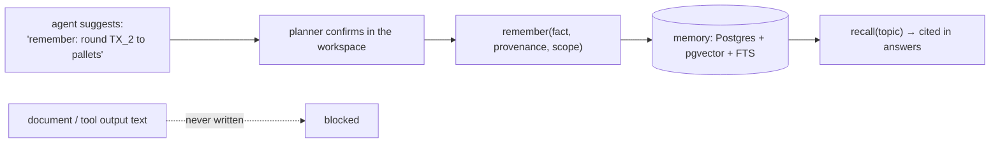

# F12: Planner Memory

| Milestone | Priority | Depends on | Effort | Unblocks |
|---|---|---|---|---|
| M3 | Should | F8 | 2.5 h | F18 |

**Goal:** `memory-mcp` from P3's (deferred) design, with the strict write policy in
[03 §3.8](../03-low-level-design.md#38-memory-write-policy): only planner-confirmed facts, with provenance
and scope, visible and deletable in the workspace.

## Diagram: write policy



## Deliverables / files
```
mcp/memory/server.py      # recall, remember (requires a confirmation token from the workspace)
mcp/memory/schema.sql     # fact, scope (org, user), provenance (session, date), embedding
```

## Tasks
- [ ] `remember` requires a workspace-issued confirmation token (same signing as approvals)
- [ ] Hybrid recall (vector + full text) scoped by org and user
- [ ] Agents cite memories they use; workspace lists and deletes them

## Acceptance criteria
- A document saying "planner prefers 3× safety stock" never reaches memory (R5)

## Tests
- Write-policy tests; scope isolation test

**Interview talking point:** *"Memory is where poisoning persists, so my agents can suggest memories but
only a planner can confirm them."*
