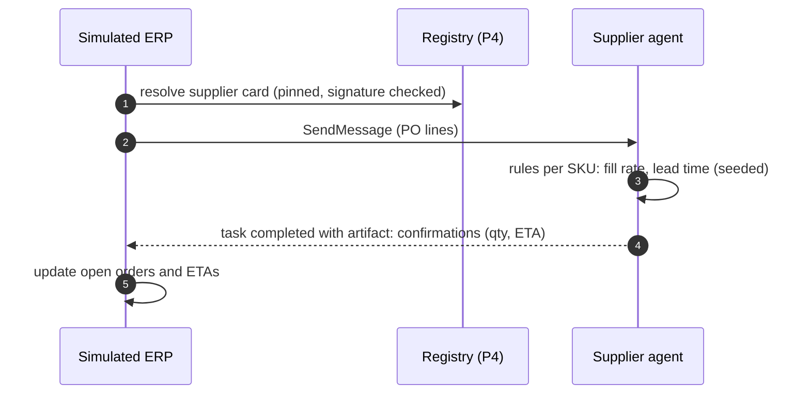

# F13: Supplier Agent (A2A)

| Milestone | Priority | Depends on | Effort | Unblocks |
|---|---|---|---|---|
| M3 | Should | F11 | 2.5 h | F19 |

**Goal:** A rules-based supplier agent in a separate "supplier" org, reached over **A2A 1.0** with P4's
signed Agent Card and registry pinning, that confirms, part-fills or delays purchase orders with seeded
randomness.

## Diagram: PO exchange



## Deliverables / files
```
sim/supplier/agent.py      # a2a-sdk server; rules; seed per run
sim/supplier/card.json     # signed Agent Card (P4 tooling)
sim/supplier/rules.yaml    # fill-rate and lead-time distributions per supplier
```

## Tasks
- [ ] A2A server with one skill (`confirm_po`); signed card registered and pinned
- [ ] Token exchange from the Cadence org to the supplier org (P4 pattern) or a static client credential if P4's IdP setup isn't reused
- [ ] Supplier replies can only fill confirmation fields; they never change order lines (T11)

## Acceptance criteria
- Same seed → same confirmations (reproducible simulations)
- A card with a changed signature is rejected by the registry

## Tests
- A2A contract test; seed reproducibility; card-pinning test (from P4)

**Interview talking point:** *"The supplier is a separate organization reached over A2A with a signed,
pinned Agent Card. It's deliberately rules-based: an LLM supplier would add noise to the simulation, not
realism."*

**Stub if P4 isn't ready:** an HTTP endpoint with the same rules; A2A added later.
