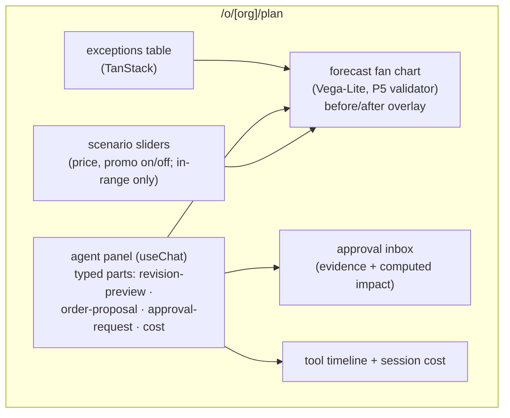

# F14: Planning Workspace

| Milestone | Priority | Depends on | Effort | Unblocks |
|---|---|---|---|---|
| M3 | Must | F10, F11 | 6 h | F19 |

**Goal:** The planner's screen on P6's shell: exceptions, forecast fans with before/after, revision diffs
with citations, scenario sliders, the approval inbox, the tool timeline and session cost, all streamed as
typed parts from the agent service.

## Diagram: screen layout



## Deliverables / files
```
web/app/o/[org]/plan/page.tsx           # layout, server components for data
web/components/forecast-fan.tsx         # Vega-Lite spec builder → P5 validator → vega-interpreter
web/components/revision-diff.tsx        # per-series before/after, citations linked to documents
web/components/approval-inbox.tsx       # approve / edit / reject; calls the token issuer
web/components/scenario-sliders.tsx     # bounded by observed covariate ranges
web/components/tool-timeline.tsx        # from trace events; cost from Switchboard headers
web/app/api/approvals/route.ts          # issues JWS approval tokens (server-side key)
```

## Tasks
- [ ] Exceptions table and slice selection
- [ ] Fan chart with quantile bands and before/after overlay, validated by P5's subset validator
- [ ] Typed parts rendered as components; no free-form HTML from the model
- [ ] Approval inbox showing evidence and **computed** impact (units, value), not model-written summaries alone
- [ ] Scenario sliders capped to observed ranges; results as a separate scenario run
- [ ] Timeline and cost per session

## Acceptance criteria
- The full demo flow (exception → review → revision → order → approval → confirmation) works in the browser
- Approval screens show numbers computed by code next to the agent's explanation

## Tests
- Playwright: approval flow, edit-then-approve, reject; chart renders with no external requests (P5 CSP test)

**Interview talking point:** *"Approvals show the evidence and the computed impact next to the model's
explanation, because approval fatigue is how human-in-the-loop quietly stops working."*
