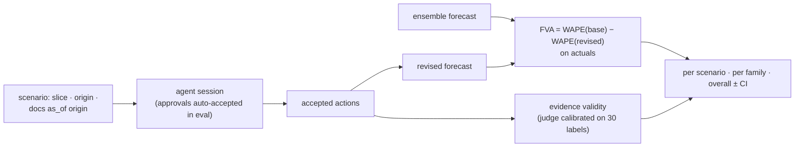

# F15: PlanBench-60 & FVA

| Milestone | Priority | Depends on | Effort | Unblocks |
|---|---|---|---|---|
| M4 | Must | F7, F10 | 5 h (6 with human comparison) | F16, F17 |

**Goal:** The 60 scenarios from [04 §4.2](../04-evaluation-design.md#42-planbench-60-do-the-adjustments-add-value)
as P3-runner task files, scored with **FVA**, harmful-adjustment rate, evidence validity and control
accuracy, for both agent designs.

## Diagram: scoring one scenario



## Deliverables / files
```
evals/planbench/scenarios/*.yaml   # 60 files: family, slice, origin, doc IDs, reference action (diagnostic)
evals/planbench/score.py           # FVA, harmful rate, control accuracy, evidence validity
evals/planbench/judge/             # evidence-validity judge + 30 hand labels (P1 calibration method)
reports/planbench-fva.md
```

## Tasks
- [ ] Write the 60 scenario files across the six families (15/10/5/15/10/5)
- [ ] FVA scoring against actuals; hand-check FVA on 5 scenarios before trusting the code
- [ ] Evidence-validity judge calibrated on 30 hand labels
- [ ] Runs for both designs, k = 3, through Switchboard with an eval budget
- [ ] (Deferred) You do 20 scenarios blind as a domain-expert reference

## Acceptance criteria
- FVA code matches the 5 hand-computed cases
- Report: mean FVA ± CI per family and overall, harmful rate, control accuracy, evidence validity, cost

## Tests
- Scoring unit tests; scenario schema validation; leakage check (no doc dated after the origin)

**Interview talking point:** *"The benchmark includes 15 scenarios where the right answer is to change
nothing, and 10 with stale or cancelled plans. An agent that adjusts eagerly looks great on the promo
cases and terrible on those, and the harmful-adjustment rate shows it."*
