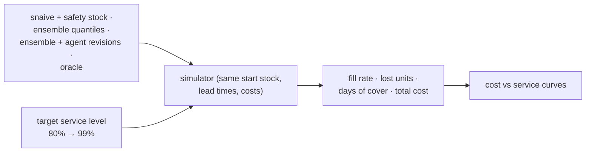

# F16: Replenishment Study

| Milestone | Priority | Depends on | Effort | Unblocks |
|---|---|---|---|---|
| M4 | Must | F11, F15 | 3 h (4.5 with stockout sensitivity) | F19 |

**Goal:** Does a better forecast lead to better stock decisions? Run the simulator on the test origins with
four policy inputs ([04 §4.3](../04-evaluation-design.md#43-replenishment-simulation-does-it-improve-decisions))
and plot cost vs service level.

## Diagram: study grid



## Deliverables / files
```
evals/replenishment/run.py      # grid over policies × service levels × origins
reports/replenishment.md        # curves, table, caveats (censored sales, assumed costs)
```

## Tasks
- [ ] Run the grid on the PlanBench slices and a wider random slice set
- [ ] Curves and a table at 95% target service
- [ ] Caveats section: M5 sales are censored; lead times and costs are assumptions
- [ ] (Deferred) Sensitivity with FreshRetailNet stockout labels

## Acceptance criteria
- Every policy uses identical starting conditions; the oracle bounds all curves

## Tests
- Simulator conservation test; seed reproducibility

**Interview talking point:** *"Accuracy is only interesting because of stock. The simulation shows what a
point of WAPE is worth in fill rate and inventory cost, and whether the agent's adjustments moved that."*
