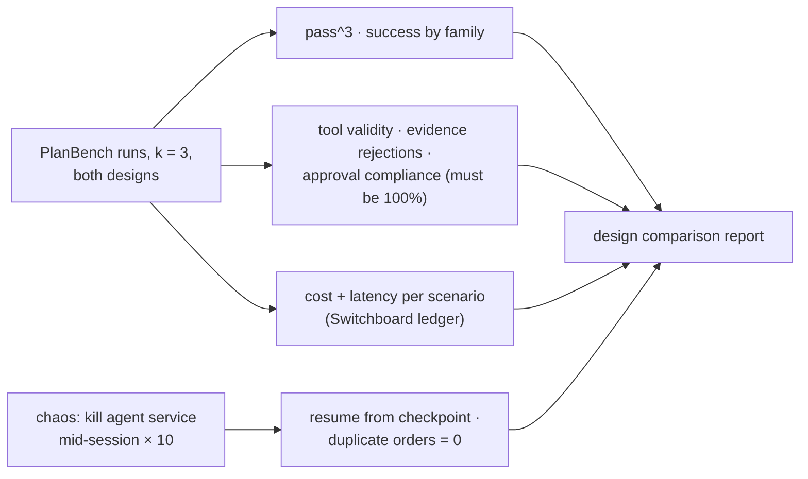

# F17: Agent Reliability & Design Comparison

| Milestone | Priority | Depends on | Effort | Unblocks |
|---|---|---|---|---|
| M4 | Must | F15 | 3 h | F19 |

**Goal:** Using the PlanBench runs (k = 3), compare the supervisor design with the single agent on
success, **pass^3**, tool-call validity, approval compliance, cost and latency; and run P3's chaos test
(kill mid-session, resume, no duplicate orders).

## Diagram: comparison



## Deliverables / files
```
evals/reliability/compare.py    # P3 runner outputs → tables + CIs
evals/reliability/chaos.py      # kill/resume harness (P3)
reports/design-comparison.md
```

## Tasks
- [ ] Tables with P3's statistics (bootstrap CIs, paired by scenario)
- [ ] Chaos runs with order-placing scenarios
- [ ] A recommendation: which design ships, and why (cost vs reliability vs FVA)

## Acceptance criteria
- Approval compliance 100% for both designs; 0 duplicate orders after chaos

## Tests
- Report regenerates from stored runs

**Interview talking point:** *"The multi-agent design had to earn its extra tokens. The comparison shows
[fill in: where it did and where the single agent was just as good] at [fill in] cost per session."*
