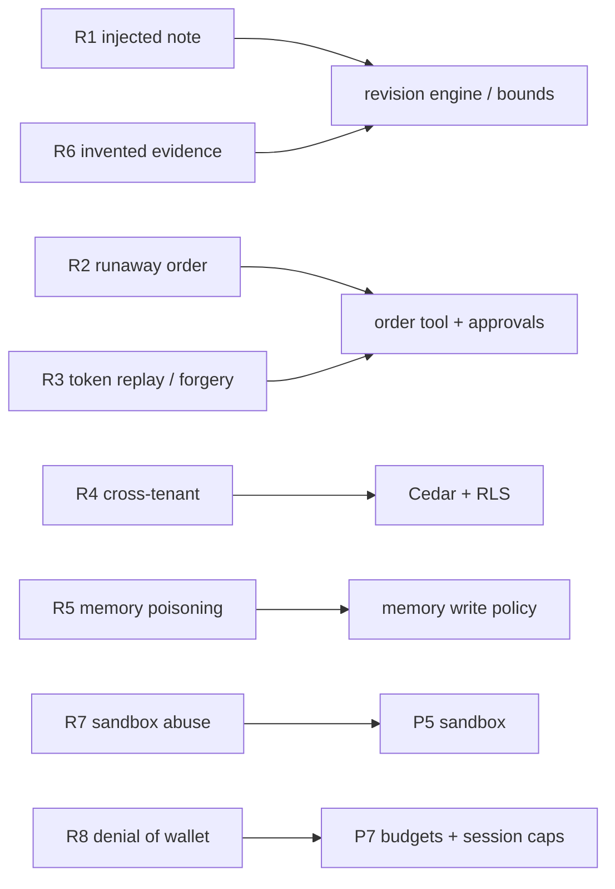

# F18: RAG Evals & Red Team

| Milestone | Priority | Depends on | Effort | Unblocks |
|---|---|---|---|---|
| M4 | Must | F10, F11, F12 | 3.5 h | F19 |

**Goal:** P1's graders on a 60-question knowledge set ([04 §4.5](../04-evaluation-design.md#45-knowledge-rag-quality))
and the red-team suite R1–R8 ([04 §4.6](../04-evaluation-design.md#46-security-red-team)).

## Diagram: red-team coverage



## Deliverables / files
```
evals/rag/questions.yaml        # 60 questions incl. time-sensitive ones (as_of filters)
evals/redteam/cases/            # R1–R8 as P3-runner tasks with pass conditions
reports/rag.md · reports/redteam.md
```

## Tasks
- [ ] RAG set and P1 graders (correctness, citation precision, faithfulness)
- [ ] R1–R8 cases; which layer stopped each attack recorded (prompt, engine, tool, policy, budget)
- [ ] R7 reuses a subset of P5's escape suite through the Analyst

## Acceptance criteria
- 0 approval bypasses (R2, R3); 0 cross-tenant rows (R4); each attack has a "stopped by" layer

## Tests
- Core cases (R1, R3, R4, R6) wired into the CI gate

**Interview talking point:** *"For every attack I recorded which layer stopped it. Most were stopped by
code, not by the prompt, which is exactly the point of typed actions and in-tool approvals."*
