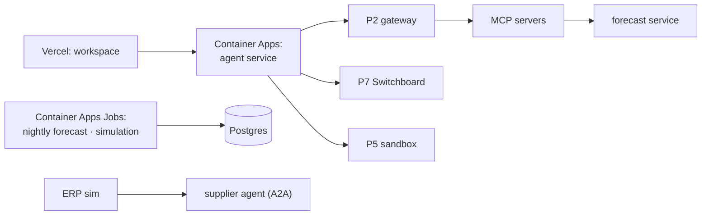

# F19: Deploy, CI Gate, Report, Demo & Video

| Milestone | Priority | Depends on | Effort | Unblocks |
|---|---|---|---|---|
| M5 | Must | F6, F13, F14, F16–F18 | 5 h | Job search |

**Goal:** The public demo on FreshRetailNet data, the CI gate from [04 §4.8](../04-evaluation-design.md#48-ci-gate),
and the capstone write-up that ties the portfolio together.

## Diagram: deployment



## Deliverables / files
```
infra/terraform/           # Container Apps + Jobs, Key Vault (approval signing key), identities
.github/workflows/gate.yml # backtest smoke, PlanBench smoke, red-team core, RAG smoke
README.md                  # architecture, eval tables, cost/session, latency, threat model, trade-offs, what failed
docs/post.md · docs/video-script.md
```

## Tasks
- [ ] Deploy with the demo org only (no M5 data online); seed forecasts and documents
- [ ] CI gate: backtest smoke, PlanBench smoke (12 scenarios), red-team core, RAG smoke
- [ ] README with all result tables and a **"what failed"** section
- [ ] Demo script: exception → review with citations → revision diff → order → approval → supplier confirmation → cost
- [ ] Post and 3-minute video; update the portfolio README to point here first

## Acceptance criteria
- A PR that lets an order through without approval, or a revision without evidence, is blocked
- Public demo URL (scaled to zero between sessions) in the README

## Tests
- The gate itself; smoke against the deployed URL

**Interview talking point:** *"This is my day job, rebuilt in public: models for the numbers, agents for
the judgement, humans for the money, and every step measured."*
