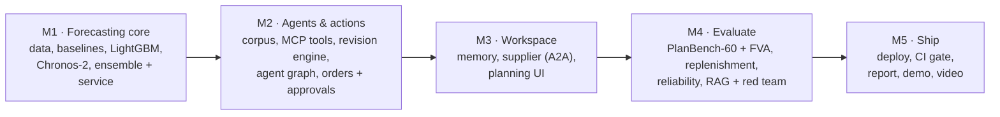
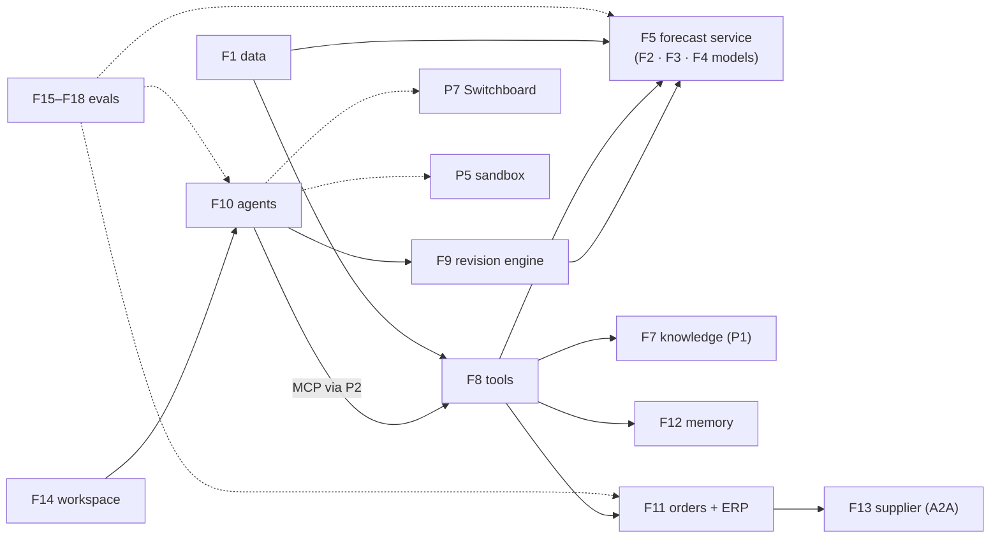
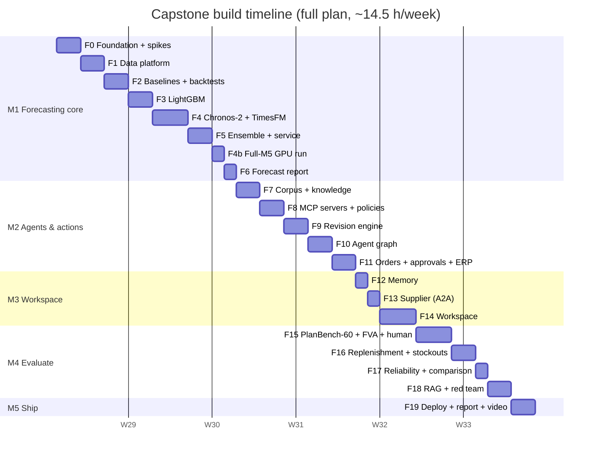

# 9. Build Plan: Feature by Feature

This plan splits the capstone into **20 features** (F0–F19), grouped into **5 milestones**. Every feature
has its own page with diagrams, files, tasks, acceptance criteria, tests, an estimate and an interview
talking point.

**Prerequisites (reused, not rebuilt):**
- P1's RAG pipeline and graders · P2's MCP gateway, Keycloak and Cedar setup · P3's runner, statistics,
  approval-token and checkpoint patterns · P4's A2A signing and registry · P5's sandbox broker and
  Vega-Lite validator · P6's Next.js shell packages · P7's Switchboard gateway.
- If any of these slipped or were cut, the feature pages say what to stub instead.

## 9.1 Build strategy: numbers first, then agents, then the evidence

Five rules:
1. **Forecasts before agents.** The agents only make sense on top of a backtested forecast. M1 ends with a
   forecast report that stands on its own.
2. **The LLM never writes numbers** (ADR-001). Any feature that lets model output reach a forecast or an
   order goes through the revision engine or the order maths, with property tests.
3. **Test the metric before trusting it.** WRMSSE is validated against the official M5 evaluation, and FVA
   scoring against hand-computed cases, before any headline number is recorded.
4. **Reuse first, stub second, rebuild never.** Each feature names the earlier-project component it uses
   and the stub if that component isn't ready.
5. **Each feature ends with a PR, green CI and a `CHANGELOG.md` entry.**

## 9.2 Master diagram: how the features connect

Arrows mean **"is required by"** (build the source first). Colours show milestones.

```mermaid
flowchart TB
    classDef m1 fill:#dbeafe,stroke:#2563eb,color:#1e3a8a
    classDef m2 fill:#dcfce7,stroke:#16a34a,color:#14532d
    classDef m3 fill:#fef3c7,stroke:#d97706,color:#78350f
    classDef m4 fill:#fce7f3,stroke:#db2777,color:#831843
    classDef m5 fill:#ede9fe,stroke:#7c3aed,color:#4c1d95

    F0["F0 Foundation + spikes"]
    F1["F1 Data platform"]
    F2["F2 Baselines +<br/>backtest harness"]
    F3["F3 LightGBM global model"]
    F4["F4 Chronos-2 (+ TimesFM)"]
    F5["F5 Ensemble, reconciliation,<br/>forecast service"]
    F6["F6 Forecast report"]

    F7["F7 Document corpus +<br/>knowledge tool"]
    F8["F8 MCP servers + policies"]
    F9["F9 Revision engine"]
    F10["F10 Agent graph"]
    F11["F11 Orders, approvals,<br/>simulated ERP"]

    F12["F12 Memory"]
    F13["F13 Supplier agent (A2A)"]
    F14["F14 Planning workspace"]

    F15["F15 PlanBench-60 + FVA"]
    F16["F16 Replenishment study"]
    F17["F17 Reliability +<br/>design comparison"]
    F18["F18 RAG evals + red team"]

    F19["F19 Deploy · CI gate ·<br/>report · video"]

    F0 --> F1
    F1 --> F2 & F7 & F8
    F2 --> F3 & F4
    F3 & F4 --> F5
    F5 --> F6 & F8 & F9 & F11
    F8 --> F10 & F11 & F12
    F9 --> F10
    F7 --> F10
    F11 --> F13
    F10 & F11 --> F14
    F7 & F10 --> F15
    F11 & F15 --> F16
    F15 --> F17
    F10 & F11 & F12 --> F18
    F6 & F14 & F16 & F17 & F18 --> F19
    F13 --> F19

    class F0,F1,F2,F3,F4,F5,F6 m1
    class F7,F8,F9,F10,F11 m2
    class F12,F13,F14 m3
    class F15,F16,F17,F18 m4
    class F19 m5
```

**Legend:** blue = M1 Forecasting core · green = M2 Agents & actions · amber = M3 Workspace · pink = M4
Evaluate · purple = M5 Ship.

## 9.3 Runtime integration map

## 9.4 Feature index

| ID | Feature | Milestone | Priority | Depends on | Effort (h) | Page |
|---|---|---|---|---|---|---|
| F0 | Foundation & spikes | M1 | Must | — | 4 | [F00](F00-foundation.md) |
| F1 | Data platform (M5, FreshRetailNet, canonical schema) | M1 | Must | F0 | 5 | [F01](F01-data-platform.md) |
| F2 | Baselines & backtest harness | M1 | Must | F1 | 4.5 | [F02](F02-baselines-backtests.md) |
| F3 | LightGBM global model | M1 | Must | F2 | 4.5 | [F03](F03-lightgbm.md) |
| F4 | Chronos-2 (and TimesFM 2.5) | M1 | Must | F2 | 4 (5.5 with TimesFM; +1 GPU full-M5 run) | [F04](F04-foundation-models.md) |
| F5 | Ensemble, reconciliation & forecast service | M1 | Must | F3, F4 | 5 | [F05](F05-forecast-service.md) |
| F6 | Forecast report | M1 | Must | F5 | 2.5 | [F06](F06-forecast-report.md) |
| F7 | Document corpus & knowledge tool | M2 | Must | F1 | 4 | [F07](F07-document-corpus.md) |
| F8 | MCP servers & role policies | M2 | Must | F1, F5 | 4.5 | [F08](F08-mcp-servers.md) |
| F9 | Revision engine | M2 | Must | F5 | 4 | [F09](F09-revision-engine.md) |
| F10 | Agent graph (supervisor, specialists, single-agent baseline) | M2 | Must | F7, F8, F9 | 5.5 | [F10](F10-agent-graph.md) |
| F11 | Orders, approvals & simulated ERP | M2 | Must | F5, F8 | 4.5 | [F11](F11-orders-approvals-erp.md) |
| F12 | Planner memory | M3 | Should | F8 | 2.5 | [F12](F12-memory.md) |
| F13 | Supplier agent (A2A) | M3 | Should | F11 | 2.5 | [F13](F13-supplier-a2a.md) |
| F14 | Planning workspace | M3 | Must | F10, F11 | 6 | [F14](F14-workspace.md) |
| F15 | PlanBench-60 & FVA | M4 | Must | F7, F10 | 5 (6 with human comparison) | [F15](F15-planbench-fva.md) |
| F16 | Replenishment study | M4 | Must | F11, F15 | 3 (4.5 with stockout sensitivity) | [F16](F16-replenishment-study.md) |
| F17 | Agent reliability & design comparison | M4 | Must | F15 | 3 | [F17](F17-reliability-comparison.md) |
| F18 | RAG evals & red team | M4 | Must | F10, F11, F12 | 3.5 | [F18](F18-rag-redteam.md) |
| F19 | Deploy, CI gate, report, demo & video | M5 | Must | F6, F13, F14, F16–F18 | 5 | [F19](F19-ship.md) |
| | **Total: full plan (chosen) / core plan** | | | | **~87.5 h / ~82.5 h** | |

## 9.5 Timeline: Option A (full plan) chosen

The roadmap gives the capstone **6 weeks** (weeks 42–47). For the first time in this portfolio, the plan
fits its slot:

| Option | Scope | Effort | Weeks |
|---|---|---|---|
| **A. Full plan ✅ chosen** | All features at full scope: everything in B **plus** TimesFM 2.5, the full-M5 foundation-model run on a rented GPU, the blind human comparison on 20 PlanBench scenarios, and the FreshRetailNet stockout sensitivity check | **~87.5 h** | **6 at ~14.5 h/week, no slack** |
| B. Core plan | Everything in the design including memory and the A2A supplier; TimesFM, the GPU run, the human comparison and the stockout check deferred | ~82.5 h | 6 at ~13.75 h/week, ~5 h slack |
| C. Lean | B without memory and the supplier agent, PlanBench-40 instead of 60, no scenario sliders | ~75 h | ~5 |

**Why A:**
- It's the flagship project, and the four extra items make its headline claims stronger: two foundation
  models instead of one, results on the full M5 instead of a sample, a "the agent vs a domain expert"
  comparison, and a measured answer to the censored-demand caveat.
- It still fits the 6-week slot, so the roadmap doesn't grow.

**The cost is zero slack.** The capstone integrates seven earlier systems, and integration is where
schedules slip. The fallback is built in: the four items A adds over B are **dropped first, in this order**,
if the schedule slips: stockout sensitivity (1.5 h), human comparison (1 h), GPU full-M5 run (1 h), TimesFM
(1.5 h). Dropping all four turns A back into B without touching anything else.

**Roadmap impact (applied):** none. The capstone stays at roadmap weeks 42–47 and the
[roadmap](../../../../04-roadmap.md) stays at **~47 weeks (about 11 months)**.

**Full plan, week by week** (roadmap weeks 42–47)

| Week | Roadmap week | Milestone | Features | Hours | Exit check |
|---|---|---|---|---|---|
| 1 | 42 | M1 | F0 foundation + spikes · F1 data platform · F2 baselines + backtests | 13.5 | M5 and FreshRetailNet loaded into the canonical schema; baselines backtested; **our WRMSSE matches the official evaluation** |
| 2 | 43 | M1 | F3 LightGBM · F4 Chronos-2 + TimesFM 2.5 · F5 ensemble, reconciliation, forecast service | 15 | Reconciled ensemble quantiles served by the API; a scenario re-forecast in ≤ 5 s |
| 3 | 44 | M1 → M2 | F4 full-M5 GPU run · F6 forecast report · F7 corpus + knowledge · F8 MCP tools · F9 revision engine (start) | 14 | Forecast report on the full M5 committed; MCP tools behind the gateway with four roles |
| 4 | 45 | M2 → M3 | F9 (finish) · F10 agent graph · F11 orders + approvals + ERP · F12 memory | 14.5 | **End-to-end from the CLI:** review → evidence-backed revision → order → approval → ERP |
| 5 | 46 | M3 → M4 | F13 supplier (A2A) · F14 workspace · F15 PlanBench-60 + FVA + human comparison | 14.5 | The workspace demo flow works with supplier confirmations; FVA for both designs and for you |
| 6 | 47 | M4 → M5 | F16 replenishment + stockout sensitivity · F17 reliability · F18 RAG + red team · F19 ship | 16 | Reports, public demo, post and video |

Week 6 is the heaviest (16 h) and has no buffer after it. Check progress at the end of week 4: if F10 or
F11 isn't done, drop the first two extra items right away rather than in week 6.

*(Dates are illustrative: the capstone starts after Project 7's 4 weeks. One "d" is one working session
of about 2–2.5 hours.)*

**Items A adds over B (~5 h), dropped first if the schedule slips**

| Drop order | Item | Effort | Value |
|---|---|---|---|
| 1 | Stockout sensitivity with FreshRetailNet labels | 1.5 h | Quantifies the censored-demand caveat |
| 2 | Blind human comparison on 20 PlanBench scenarios | 1 h | "The agent vs a domain expert" (you) |
| 3 | Full-M5 foundation-model backtest on a rented GPU | 1 h | Removes the "sample" caveat |
| 4 | TimesFM 2.5 (univariate) in the comparison | 1.5 h | A second foundation model in the report |

## 9.6 Milestone exit criteria

| Milestone | Done when |
|---|---|
| **M1 Forecasting core** | Canonical data for M5 (local) and FreshRetailNet (demo); baselines, LightGBM and Chronos-2 backtested on rolling origins with WRMSSE (validated), WAPE, MASE, bias and quantile loss; reconciled ensemble served by the API with scenarios and analogs; forecast report committed. |
| **M2 Agents & actions** | Document corpus searchable with citations; MCP tools behind the P2 gateway with four roles; revision engine enforcing bounds, windows and evidence; supervisor and single-agent designs both complete a review; orders need signed approvals and are idempotent; the ERP simulator runs. |
| **M3 Workspace** | Planner memory with a write policy; supplier confirmations over A2A; the workspace shows exceptions, bands, diffs with citations, scenario sliders, the approval inbox, the tool timeline and session cost. |
| **M4 Evaluate** | PlanBench-60 with FVA, harmful rate and control accuracy for both designs (k = 3); replenishment cost vs service curves; pass^3 and chaos-resume results; RAG metrics; red-team R1–R8 with 0 approval bypasses. |
| **M5 Ship** | Deployed demo on FreshRetailNet data; CI gate from [04 §4.8](../04-evaluation-design.md#48-ci-gate); README with architecture, eval tables, cost per session, latency, threat model, trade-offs and **what failed**; post and 3-minute video. |

## 9.7 Definition of done (every feature)

- [ ] PR with green CI (lint, types, tests, supply-chain job)
- [ ] Anything that can change a forecast or an order → property tests on the engine/maths first
- [ ] New tool → Cedar policy + role test; new document type → injection test case
- [ ] No raw M5 data in the repo or the demo (CI hash check)
- [ ] Traces and cost visible for new agent paths
- [ ] Docs updated (this plan's checkboxes, the setup guide, `CHANGELOG.md`)

## 9.8 Risk register

| Risk | Impact | Mitigation |
|---|---|---|
| An earlier project's component isn't ready | Integration stalls | Each page names a stub (e.g. direct Postgres tools instead of the P2 gateway); record the gap in the README |
| Chronos-2 too slow on CPU | Scope, scenario latency | Spike in F0; stratified sample; LightGBM-based scenarios |
| WRMSSE implementation wrong | Headline numbers wrong | Validate against the official evaluation in F2 before anything else |
| Agent adjustments show negative FVA | Weaker headline | That's a finding worth reporting; tighten bounds, require analogs, and show which families help |
| PlanBench documents leak the answer | Inflated FVA | Documents written only from information available before the origin; peer-check 10 of them against the rules in F7 |
| M5 terms stricter than assumed | Demo/data plan | F0 spike reads them; M5 results kept as aggregate metrics only |
| Evaluation spend overruns | Budget | All calls through P7 with an eval budget; cheap models for smoke runs |
| Scope creep (price optimization, multi-echelon, real ERP) | Timeline | Out-of-scope list in [01 §1.7](../01-requirements.md#17-scope) is binding |
| No slack in the full plan | Week 6 overruns | Drop A's four extra items in the stated order; checkpoint at the end of week 4 |
