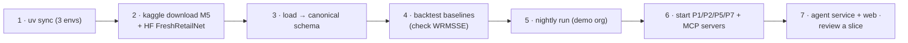

# 10. Setup Guide: accounts, keys and the first run

> **Status:** No code exists yet. This page is the **target setup**: commands become real as F0–F11 are
> built and may change slightly. Keep it in sync with the repo.

## 10.1 What you need, and when

| Needed from | Tool / account | Used for | Cost |
|---|---|---|---|
| **M1** | Python 3.12, **uv**, Docker + Compose, Node 24 + pnpm | Three Python envs, web | Free |
| M1 | **Kaggle** account + API token, M5 competition rules accepted | M5 download (local only) | Free |
| M1 | **Hugging Face** (anonymous is enough for public data/weights) | FreshRetailNet-50K, Chronos-2 weights | Free |
| M1 | Optional: a rented GPU for a few hours | Full-M5 foundation-model backtest (deferred in B) | ≈ $10–30 |
| **M2** | Projects 1, 2, 3, 5 and 7 running locally (compose) or deployed | Knowledge, MCP gateway, runner, sandbox, Switchboard | As in those projects |
| M2 | A Switchboard org key with an eval budget | All model calls | ≈ $40–80 for all evals |
| **M3** | Project 4's registry and signing tools; Project 6's shell packages | Supplier agent; workspace | — |
| **M5** | Azure (existing Terraform modules), Vercel | Deploy | ≈ $20–40/month while demoing |

## 10.2 Environment variables

```bash
# --- forecast service (forecast/.env) ---
DATABASE_URL=postgresql://cadence:…@localhost:5432/cadence
DATA_DIR=./data/local                     # M5 lives here, never committed
CHRONOS2_REVISION=<commit hash>           # pinned model revision
TORCH_NUM_THREADS=4

# --- agents + MCP (agents/.env) ---
SWITCHBOARD_BASE_URL=http://localhost:8080/v1
SWITCHBOARD_API_KEY=sb_dev_…              # org key with a daily budget
MCP_GATEWAY_URL=http://localhost:9000     # P2 gateway
KEYCLOAK_ISSUER=http://localhost:8081/realms/cadence
SANDBOX_MCP_URL=http://localhost:9100/mcp # P5 broker
KNOWLEDGE_MCP_URL=http://localhost:9200/mcp
LANGFUSE_PUBLIC_KEY=
LANGFUSE_SECRET_KEY=

# --- web (web/.env.local), in addition to P6's variables ---
AGENT_SERVICE_URL=http://localhost:8200
APPROVAL_SIGNING_KEY=<JWK, server-side only> # Key Vault in Azure; never in the agent service
```

The agent service **never** holds the approval signing key; only the workspace backend issues tokens.

## 10.3 First run



```bash
uv sync --frozen --project forecast && uv sync --frozen --project agents && uv sync --frozen --project evals
kaggle competitions download -c m5-forecasting-accuracy -p data/local && unzip -o data/local/*.zip -d data/local
uv run --project forecast python -m data.loaders.m5 --out data/local/m5.parquet
uv run --project forecast python -m data.loaders.frn50k --subset demo --out data/local/frn.parquet
uv run --project forecast python -m forecast.backtest.run --models snaive,ets --origins V --check-wrmsse
uv run --project forecast python -m forecast.jobs.nightly --org demo
docker compose -f infra/compose.yaml up -d      # MCP servers + references to P1/P2/P5/P7 services
uv run --project agents uvicorn agents.service.app:app --port 8200
pnpm --filter web dev                           # http://localhost:3000/o/demo/plan
```

## 10.4 Keeping costs safe

| Control | Setting |
|---|---|
| Model spend | Switchboard budgets per org key; per-session step and cost caps in the graph |
| Evaluations | Cheap model for smoke runs; the main model only for recorded k = 3 runs |
| Forecasting | CPU by default; GPU only for the one-off full-M5 run |
| Azure | Scale to zero; jobs run only when triggered; budget alert |
| Data | M5 stays in `data/local` (git-ignored, CI hash check) |

## 10.5 Troubleshooting

| Symptom | Likely cause | Fix |
|---|---|---|
| WRMSSE doesn't match the official value | Weights from the wrong window, or scale from zeros-only history | Use the last 28 days' dollar sales for weights; start scale at each series' first non-zero sale |
| Chronos-2 very slow | Thread settings or tiny batches | Set `TORCH_NUM_THREADS`; increase batch size; use the stratified sample |
| Forecasts don't add up | Reconciliation skipped after a revision | Check the engine re-reconciles the affected branch |
| Every revision rejected with `evidence_required` | Citations not from this session's tool calls | Check the agent calls `search`/`find_analogs` before proposing |
| `approval_required` on approved orders | Token expired, or lines edited after approval | Re-approve; tokens bind the exact lines |
| Agent sees future documents | Missing `as_of_date` filter | Knowledge tool must receive the forecast origin |
| Supplier confirmations change between runs | Seed not fixed | Set the simulation seed |
